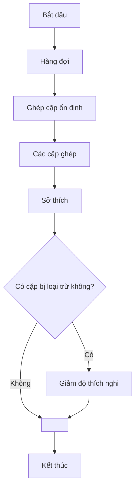
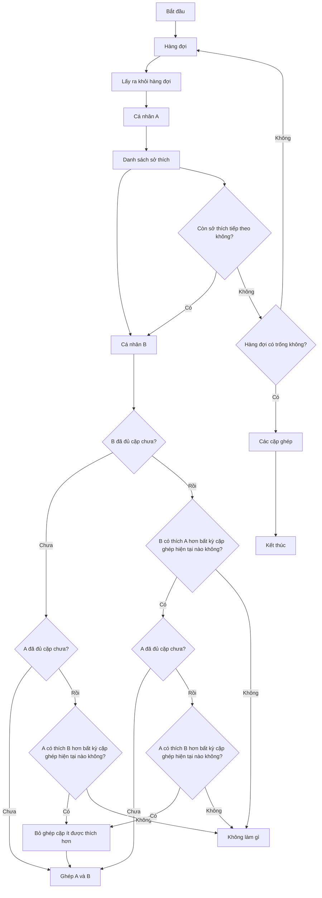
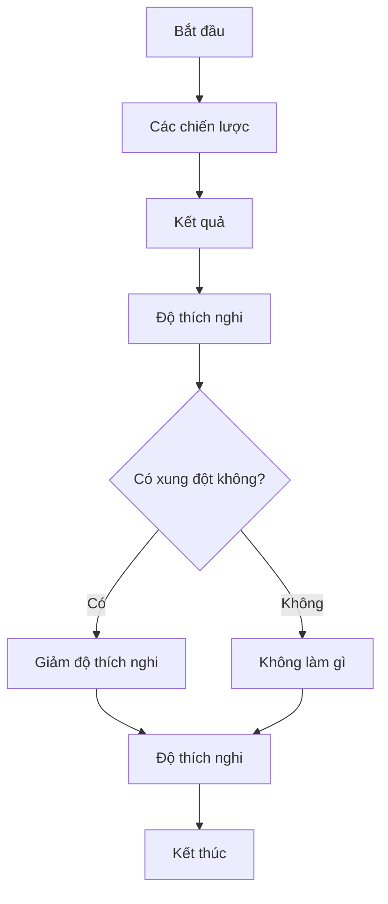
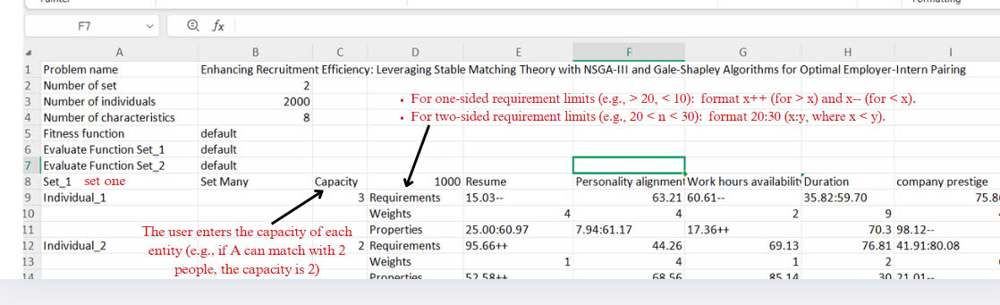
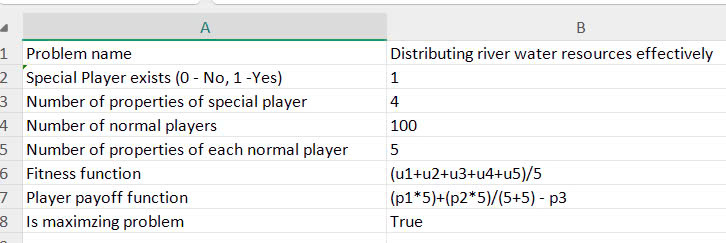
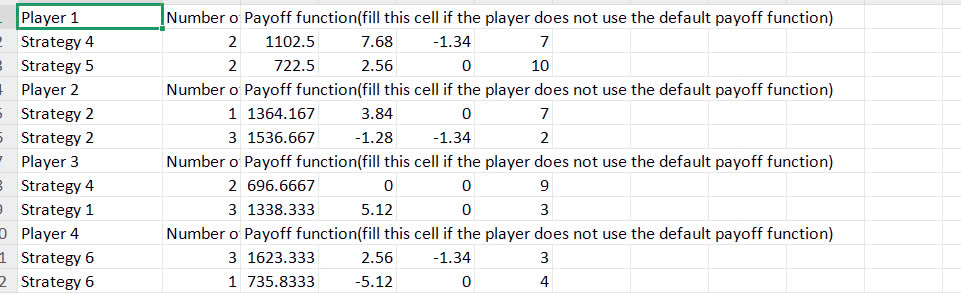
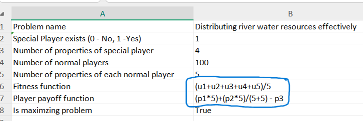
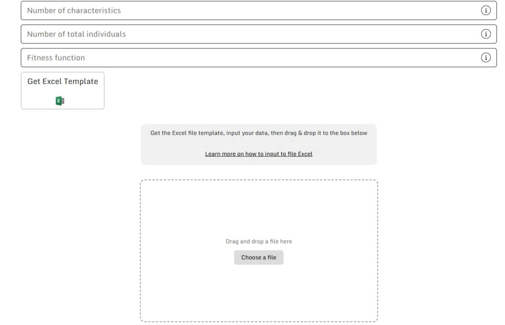
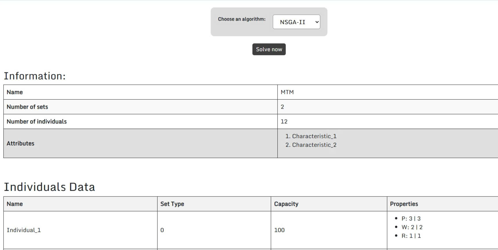
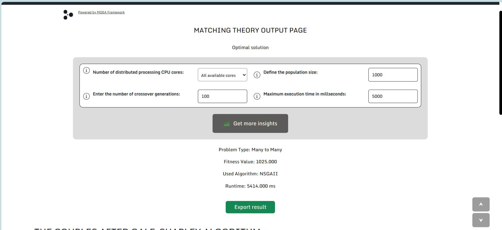

# **1\. Giới thiệu**

### **Giới thiệu**

Ứng dụng này được phát triển để giúp bạn tính toán và tìm ra các giải pháp tối ưu trong các bài toán về Lý thuyết Trò chơi (Game Theory) và Ghép cặp ổn định (Stable Matching Theory). Với mục tiêu giải quyết các vấn đề phức tạp trong các lĩnh vực này, ứng dụng sử dụng các thuật toán tối ưu hóa tiên tiến như Thuật toán Di truyền (Genetic Algorithms). Mấy cái này giúp ước tính và đạt được kết quả chính xác, từ đó mang lại các giải pháp hiệu quả cho người dùng. Các công nghệ được sử dụng trong ứng dụng bao gồm: ngôn ngữ lập trình Java, Spring Boot Framework (dùng để xây dựng và triển khai phần backend của ứng dụng, hỗ trợ kiến trúc Model-View-Controller) và MOEA Framework (một thư viện hỗ trợ các thuật toán tối ưu hóa tiến hóa, đặc biệt cho các bài toán tối ưu hóa đa mục tiêu).

Mục tiêu chính của cuốn sổ tay này là cung cấp một hướng dẫn chi tiết, dễ hiểu để bạn có thể sử dụng ứng dụng một cách hiệu quả và tận dụng tối đa các tính năng của nó. Hướng dẫn này sẽ chỉ cho bạn qua từng bước, từ việc cài đặt ứng dụng trên các hệ điều hành khác nhau, các yêu cầu hệ thống cần thiết để ứng dụng hoạt động, cách tạo và xác thực các biểu mẫu dữ liệu cho các bài toán, các bước cài đặt chi tiết, chạy ứng dụng bằng các công cụ dòng lệnh hoặc IDE, và phân tích kết quả đầu ra. Ngoài ra, sổ tay còn cung cấp các mẹo tối ưu hóa, cách tùy chỉnh kết quả đầu ra để đáp ứng yêu cầu của bạn và cách khắc phục các sự cố thường gặp trong quá trình sử dụng. Điều này đảm bảo rằng bạn có thể tối đa hóa hiệu suất của ứng dụng và đạt được kết quả đầu ra có độ chính xác cao.

# **2\. Bảng mục lục**

1. [Giới thiệu](#1-giới-thiệu)
2. [Table of Contents](#2-table-of-contents)
3. [Chi tiết các Module](#3-chi-tiết-các-module)
   - [SMT (Stable Matching Theory)](#31-smt-stable-matching-theory)
   - [GT (Game Theory)](#32-gt-game-theory)
4. [Cài đặt trên máy](#4-cài-đặt-trên-máy)
5. [Tạo Biểu mẫu Dữ liệu](#5-tạo-biểu-mẫu-dữ-liệu)
6. [Solve](#6-solve)
7. [Xem Chi tiết Kết quả ](#7-xem-chi-tiết-kết-quả)
8. [Triển khai](#8-triển-khai)
9. [Những người tham gia](#9-những-người-tham-gia)
10. [Kết thúc](#10-kết-thúc)

# **3\. Chi tiết các Module**


### **3.1 SMT (Stable Matching Theory)**

#### **Các loại bài toán**

- **MTM (Many-to-Many)**: Mỗi cá nhân (từ hai tập hợp riêng biệt) có thể có nhiều cặp ghép.
- **OTM (One-to-Many)**: Một cá nhân từ một tập hợp có thể có nhiều cặp ghép, nhưng mỗi cá nhân trong tập hợp đối diện chỉ có thể được ghép một lần.
- **OTO (One-to-One)**: Đây là bài toán Gale-Shapley chuẩn, trong đó mỗi cá nhân ở cả hai tập hợp được ghép với đúng một cá nhân từ tập hợp đối diện.

#### **Evaluate Function(Hàm đánh giá)**

**Hàm Evaluate** dành riêng cho các cá nhân trong một tập hợp, được sử dụng để tính toán sự ưa thích của một cá nhân đối với những người khác dựa trên các thành phần thuộc tính của cá nhân đó.

#### **Fitness Function(Hàm thích nghi)**

**Hàm Fitness** đánh giá kết quả cuối cùng của quá trình ghép cặp. Nó tính toán xem một cặp ghép tốt hay "thích nghi" đến mức nào dựa trên sự ưa thích của các cặp được ghép. Mặc định, đây là tổng của danh sách.

#### **Exclude Pair (Loại trừ cặp) **

Chức năng **Loại trừ cặp** cho phép loại bỏ các cặp cụ thể khỏi việc được ghép, ngay cả khi họ có điểm ưa thích cao.

#### **Capacity (Sức chứa) **

**Sức chứa** đề cập đến số lượng cặp ghép tối đa mà một cá nhân có thể có.

#### **Properties of Each Individual (Thuộc tính của mỗi Cá nhân) **

- **Set indices (Chỉ số tập hợp)**
- **Capacity**: Mỗi cá nhân có thể có một sức chứa xác định, giới hạn số lượng cặp ghép họ có thể tham gia.
- **PWR (Properties(Thuộc tính))**:
  - **Value(giá trị)**: Đại diện cho một thước đo bằng số hoặc định tính về tầm quan trọng hoặc sự phù hợp của cá nhân trong quá trình ghép cặp.
  - **Weight(trọng số)**: Đại diện cho tầm quan trọng tương đối hoặc ưu tiên của cá nhân đó trong quyết định ghép cặp.
  - **Requirement(yêu cầu)**: Các yêu cầu tối thiểu cần thiết mà một cá nhân phải có để được xem xét cho một cặp ghép.
#### **Flow of Event(Luồng sự kiện)**

Với mỗi lần lặp, một hàng đợi các cá nhân được sử dụng để tạo ra các cặp ghép ổn định, sau đó được sử dụng để tính toán độ thích nghi. Thứ tự của hàng đợi sẽ được điều chỉnh bởi Thuật toán Di truyền (the Genetic Algorithm).



### ** Cốt lõi Ghép cặp ổn định (Core Stable Matching)**

Như đã đề cập, hệ thống mở rộng bài toán gốc bằng cách giới thiệu ghép cặp nhiều-với-nhiều. Điều này đòi hỏi một số sửa đổi đối với Thuật toán Gale-Shapley.



### **3.2 GT (Game Theory)**

Cách biểu diễn trò chơi duy nhất là ở **dạng thông thường (Normal form)**, nơi tất cả người chơi đưa ra quyết định cùng một lúc hoặc không có thông tin về quyết định của người khác.

1. **Problem Information**

- **o	Hàm tính toán kết quả (Payoff function)**: Hàm này tính toán phần thưởng (hoặc kết quả) mà mỗi người chơi nhận được dựa trên chiến lược họ đã chọn và chiến lược của những người chơi khác. Việc tính toán kết quả sẽ phụ thuộc vào sự tương tác giữa các chiến lược này. Xác định cách tính toán kết quả từ một chiến lược của người chơi. Cần lưu ý rằng hàm này sẽ là mặc định cho bất kỳ người chơi nào không có hàm kết quả riêng.
- **o	Hàm thích nghi (Fitness function)**: Một hàm đánh giá mức độ tốt hoặc tối ưu của một chiến lược của người chơi, thường bằng cách đánh giá các giá trị kết quả được tạo ra bởi các chiến lược đã chọn.
- **o	Người chơi đặc biệt (Special player)**: Một người chơi có thể có các ràng buộc hoặc khả năng bổ sung, khác biệt với những người chơi khác.
- **o	Ma trận chiến lược và thuộc tính của chúng (Strategy and their property matrix)**: Một bảng đại diện cho tất cả các chiến lược có sẵn cho người chơi cùng với các thuộc tính của mỗi chiến lược.
- **Xung đột (Conflict)**: A functionality that can prevent or discourage players from choosing specific strategies at any iteration of the game.

Sau khi những dữ liệu này được cung cấp cho hệ thống, kết quả của mỗi chiến lược của người chơi sẽ được tính toán bằng hàm kết quả. Lưu ý rằng cùng một chiến lược có thể có các kết quả khác nhau với các giá trị khác nhau.

|          | Strategy 1 | Strategy 2 |
| :------: | :--------: | :--------: |
| Player 1 |    100     |     45     |
| Player 2 |     78     |    244     |

Trong bảng này, các giá trị đại diện cho kết quả của Người chơi 1 và Người chơi 2 cho mỗi sự kết hợp chiến lược. Ví dụ, nếu Người chơi 1 chọn Chiến lược 1 và Người chơi 2 chọn Chiến lược 2, Người chơi 1 nhận được kết quả là 100 và Người chơi 2 nhận được kết quả là 78.

---

2. **Luồng sự kiện (Flow of Event)**

Với mỗi lần lặp, tất cả người chơi đồng thời đưa ra quyết định, tương ứng với kết quả của họ. Sau đó, **Thuật toán Di truyền(Genetic Alogrithm)** được chọn sẽ sử dụng hàm thích nghi để đánh giá danh sách các kết quả.
Đây là cách tính toán độ thích nghi:



# **4\. Cài đặt trên máy**

### Khả năng tương thích và Kiểm thử

Nếu không có kết quả, bạn cứ thử trên hệ thống của mình rồi cho bọn mình phản hồi nhé.

| Hệ điều hành | Phiên bản/ Bản phân phôi | Trạng thái  | Ghi chú                                |
| --------- | ---------------- | ------- | ----------------------------------- |
| Windows   | 10               | N/A     | Untested                            |
|           | 11               | Working | Tested                              |
| WSL       | Ubuntu           | Working | -PwithFront stuck on unpacking node |
| Linux     | Ubuntu           | Working | Tested, Deployed                    |
|           | Debian           | N/A     | Untested                            |
| Mac       | N/A              | N/A     | Untested                            |

### Yêu cầu

1. git
2. JDK 17 (Temurin/ OpenJDK)
3. Maven 3.8.3+ (or use wrapper in project)

### Các bước

1. Clone the repository về

```bash
git clone https://github.com/FitHanuSpecialSubject/GA-Application-Java.git
cd GA-Application-Java
```

2. Build dự án

#### Dùng maven wrapper (khuyên dùng):

- Linux

```bash
bash ./mvnw clean install
```

- Windows

```bash
mvnw.cmd clean install
```

- Using system maven (require installation)

#### maven setup instruction: [How to install maven Win, Mac, Linux](https://www.baeldung.com/install-maven-on-windows-linux-mac)

```bash
mvn clean install
```

### (Optional) Install with webapp

#### Clone & Install FE application via maven profile

```bash
mvn clean install -PwithFront
```

## Usage

### Backend run

- Run via maven profile

```bash
mvn verify -DskipTests -PstartBE
```

- Chạy file .jar đã được tạo ra từ bước build dự án. (khuyên dùng)

```bash
java -jar target/[generated_application_filename].jar
```

- •	Hoặc dùng các IDE Java xịn sò như IntelliJ IDEA, Eclipse, Netbeans, ... để chạy với các cấu hình có sẵn của IDE.

### Webapp run via maven (for a quick demo via terminal)

```bash
mvn verify -DskipTests -Dskip.node-and-npm.install -PstartFE
```

- Chạy riêng với BE
- Có thể cần phải tắt tiến trình thủ công sau khi đóng, `npx cross-port-killer 3000` có thể giúp.

Máy chủ ứng dụng web sẽ khởi động tại localhost:3000 bằng `npx serve` với các tài nguyên tĩnh được tạo bởi  `npx react-scripts build`

# **5\. Tạo Biểu mẫu Dữ liệu**
**[Video hướng dẫn](https://drive.google.com/drive/folders/16e0t3Vhkr4Bc85k0Bd_aFFTEpU6s_s9R?usp=drive_link)**

### **Mục đích của Biểu mẫu Dữ liệu**

Biểu mẫu Dữ liệu cho phép người dùng xác định và cấu trúc dữ liệu đầu vào để giải quyết các bài toán khác nhau một cách hiệu quả. Có hai loại biểu mẫu dữ liệu: biểu mẫu dữ liệu SMT và biểu mẫu dữ liệu GT. Mỗi loại có các yêu cầu riêng về định dạng và cấu trúc đầu vào để đảm bảo giải quyết bài toán chính xác và hiệu quả.

## 5.1. **Lý thuyết Ghép cặp ổn định**

Biểu mẫu dữ liệu yêu cầu người dùng nhập một danh sách những người tham gia cùng với sở thích được xếp hạng của họ. Mỗi người tham gia phải có một danh sách sở thích đầy đủ và được sắp xếp chính xác để duy trì tính nhất quán và công bằng trong quá trình ghép cặp.

#### 5.1.1. **Đặt tên trang tính **

- Bao gồm: "Problem Info", "Problem Data".
- Lưu ý: Nhớ đặt tên trang tính cho đúng, không là lỗi đấy.

#### 5.1.2. **Problem information**

| Tên                          | Giải thích                                                                               | Kiểu dữ liệu | Ghi chú                          |
| ----------------------------- | ----------------------------------------------------------------------------------------- | --------- | ------------------------------ |
| **Problem name**              | Tên được lấy từ dữ liệu do người dùng nhập.                                      | text      |                                |
| **Number of set**             | Tổng số cá nhân trong mỗi tập hợp tham gia.                            | int       | phải >= 2                   |
| **Number of individuals**     | Tổng số cá nhân trong mỗi tập hợp tham gia.                                | int       | phải >3                     |
| **Number of characteristics** | Tổng số thuộc tính của các cá nhân tham gia.                          | int       |                                |
| **Fitness function**          | Một hàm đánh giá sự phù hợp hoặc hiệu quả của một cá nhân trong mô hình. | text      | Công thức chính xác hoặc giá trị mặc định |
| **Evaluate Function Set_1**   | Tập hợp các hàm đánh giá đầu tiên được sử dụng để đánh giá các cá nhân.                         | text      | Công thức chính xác hoặc giá trị mặc định |
| **Evaluate Function Set_2**   | Tập hợp các hàm đánh giá thứ hai, có thể sử dụng các tiêu chí khác nhau.               | text      | Công thức chính xác hoặc giá trị mặc định |

#### 5.1.3. **Dữ liệu bài toán**

**Các thành phần**



**Cách nhập giá trị?**

Sự ưa thích của Individual A đối với Individual B dựa trên 3 yếu tố:
- **Requirement**
- **Value**
- **Weight**

Các yếu tố này có trong mọi thuộc tính của một cá nhân và được hàm Đánh giá (Evaluate function) sử dụng để tính toán sở thích.

---

### Ví dụ

| Individual A | Weight | Value | Requirement |
| :----------: | :----: | :---: | :---------: |
|  Property 1  |   10   |  11   |     12      |
|  Property 2  |   7    |  13   |     13      |
|  Property 3  |   5    |  18   |   18:100    |

| Individual B | Weight | Value | Requirement |
| :----------: | :----: | :---: | :---------: |
|  Property 1  |   3    |  12   |     12      |
|  Property 2  |   8    |  13   |     13      |
|  Property 3  |   6    |  18   |   18:100    |

### Quy tắc cho các thuộc tính

- Weight $>=$ 0
- Value $>=$  0
- Yêu cầu có thể là một số dương (dùng trong các phép tính tùy chỉnh) hoặc một chuỗi (như "1 bound", "2 bounds", hoặc "scale target") (dùng trong các phép tính mặc định).

### Ký hiệu chung

- $R_i$ đại diện the Requirement cho thuộc tính $i$
- $W_i$ đại diện the Weight cho thuộc tính $i$
- $P_i$ đại diện the Value cho thuộc tính $i$

Example: Custom function in Individual A: ($P_1$ - $R_1$) ^ $W_1$

$P_1$ là the Value của thuộc tính 1: 11  
$R_1$ là the Requirement của thuộc tính 1: 12  
$W_1$ là the Weight của thuộc tính 1 :10

Kết quả là: ($P_1$ - $R_1$) ^ $W_1$ = ($11$-$10$) ^ $12$ = $1$

---

### Đánh giá tùy chỉnh

Một hàm đánh giá tùy chỉnh là:

Các giá trị của $R_2$ và $W_1$ được lấy từ Individual A, và $P_1$ được lấy từ Individual B.

- $W_1$ và $P_1$ thì dễ hiểu, còn $R_2$ có chút lằng nhằng.
- Các quy tắc cú pháp cho kết quả khác nhau cho các phép tính Yêu cầu:

1. $x--$ trả về  $x$
2. $x:y$ trả về $\frac{x + y}{2}$

3. $x++$ trả về $x$
4. $x$ trả về $x$

Sử dụng các quy tắc này, sở thích của A đối với B được tính như sau:
$12 + 11 * 12 = 144$

---

### Đánh giá mặc định

Đánh giá mặc định sử dụng tất cả các thuộc tính để tính toán sở thích. Công thức có thể được biểu diễn là:

$$P_A(B) = \sum_{i=1}^{N} R_i(P_i) \times W_i$$

Where:

- $N$ là số lượng thuộc tính của một cá nhân
- $R_i$ là hàm yêu cầu cho thuộc tính $i$ của A
- $W_i$ là trọng số cho thuộc tính $i$ của A
- $P_i$ is là giá trị cho thuộc tính $i$ của B

---

### Các hàm Yêu cầu

1.  
$$
    R_i(P_i) = x - - (P_i) =
    \begin{cases}
    2 & \text{if } x = 0 \\
    0 & \text{if } P_i > x \\
    \frac{x + |P_i - x|}{x} & \text{else}
    \end{cases}
    $$

2.  
$$
    R_i(P_i) = x + + (P_i) =
    \begin{cases}
    2 & \text{if } x = 0 \\
    0 & \text{if } P_i < x \\
    \frac{x + |P_i - x|}{x} & \text{else}
    \end{cases}
    $$

3.  
$$
    R_i(P_i) = x : y (P_i) =
    \begin{cases}
    \frac{|y - x|}{2} - \frac{|x + y|}{2} + \frac{|P_i|}{|y - x|} + 1 & \text{if } P_i \in [x, y] \\
    0 & \text{else}
    \end{cases}
    $$

4.  
$$
    R_i(P_i) = x(P_i) =
    \begin{cases}
    0 & \text{if } P_i < 0 \text{ or } P_i > 10 \\
    0 & \text{if } |P_i - x| > 7 \\
    1 & \text{if } |P_i - x| > 5 \\
    \frac{10 - |P_i - x|}{11} & \text{else}
    \end{cases}
    $$

---

### Áp dụng các Quy tắc này

Bây giờ hãy áp dụng các quy tắc này để tính sở thích của A đối với B.
$$
P_A(B) = R_1(P_1) * W_1 + R_2(P_2) * W_2 + R_3(P_3) * W_3
$$

Thay thế các giá trị từ các bảng:

Điều này đơn giản hóa thành:
$$
= \frac{12 + |12 - 12|}{12} * 12 + 0 * 13 + \left( \frac{100 - 18}{2} - \frac{100 + 18}{2} + 1 \right) * 23
$$

Kết quả là:

$$
= 12 + 0 + 23 = 35
$$

**Làm thế nào để nhập cú pháp hàm?**

- Syntax

  - $: i - chỉ số của MatchSet trong "matches"

    - $: giá trị (1 hoặc 2) đại diện cho tập 1 (0) hoặc tập 2 (1)
    - $: S(set) - Tổng tất cả các điểm payoff của "set" được đánh giá bởi tập hợp đối diện
    - $: M(i) - Giá trị về độ hài lòng của một MatchSet cụ thể, ví dụ: M0 (độ hài lòng của Individualsố 0)
      _ Các hàm được hỗ trợ:
      _ #: SIGMA{S1} tính tổng tất cả MatchSet của một tập hợp, ví dụ: SIGMA{S1}

          * Các phép tính toán học được hỗ trợ:
          * Tên:    Cách dùng
          * 1. trị tuyệt đối        : abs(biểu thức)
          * 2. lũy thừa      : (biểu thức)^(biểu thức)
          * 3. sin                 : sin(biểu thức)
          * 4. cos                 : cos(biểu thức)
          * 5. tan                : tan(biểu thức)
          * 6. logarithm     : log(biểu thức)(biểu thức)
          * 7. căn bậc hai: sqrt(biểu thức)

- Lưu ý: Bạn có thể điền "Default" vào hàm.

## 5.2. **Game Theory**

Biểu mẫu dữ liệu bao gồm việc xác định số lượng người chơi, các chiến lược có sẵn của họ và ma trận kết quả tương ứng. Điều này đảm bảo rằng hệ thống có thể tính toán chính xác các chiến lược và kết quả tối ưu dựa trên dữ liệu đầu vào.

#### 5.2.1. **Đặt tên trang tính **

- Bao gồm: : "Problem Info", "Problem Data".
- Lưu ý: Nhớ đặt tên trang tính cho đúng, không là lỗi đấy.

#### 5.2.2. **Thông tin bài toán**

| Tên                                           | Giải thích                                                                                                                       | Kiểu dữ liệu | Ghi chú                          |
| ---------------------------------------------- | --------------------------------------------------------------------------------------------------------------------------------- | --------- | ------------------------------ |
| **Problem name**                               | Tên được lấy từ dữ liệu do người dùng nhập.                                                                              | text      |                                |
| **Special Player exists**                      | Xác định xem có người chơi đặc biệt hay không (0: Không, 1: Có). Người chơi đặc biệt có thể có vai trò quan trọng hoặc độc nhất trong trò chơi.  | int       | 0 hoặc 1                         |
| **Number of properties of special player**     | Số lượng đặc điểm hoặc thuộc tính của người chơi đặc biệt.                                                                | int       |                                |
| **Number of normal players**                   | Tổng số người chơi thông thường trong trò chơi.                                                                                  | int       |                                |
| **Number of properties of each normal player** | Số lượng thuộc tính cho mỗi người chơi bình thường, có thể liên quan đến chiến lược, tài nguyên hoặc lợi ích.                          | int       |                                |
| **Fitness function**                           | Một hàm đánh giá sự thành công của một người chơi.                                                                                | text      | Công thức chính xác hoặc giá trị mặc định |
| **Player payoff function**                     | Một hàm xác định phần thưởng hoặc lợi ích mà một người chơi nhận được dựa trên chiến lược và hành động của họ.                       | text      | Công thức chính xác hoặc giá trị mặc định |
| **Is maximizing problem**                      | Chỉ định xem bài toán có phải là bài toán tối đa hóa hay không.                                                                          | boolean   | true hoặc false                  |

  **Ví dụ ở đây**  
  

#### 5.2.3. **Dữ liệu bài toán**

**Các thành phần**

Ví dụ ở đây




**Cách nhập giá trị?**

- Players:

  - Trò chơi được biểu diễn ở dạng chiến lược tiêu chuẩn (bình thường).
  - Tập hợp người chơi được ký hiệu là  $I = {1, ..., n}$.
  - Mỗi người chơi iinI có một tập hợp hành động được ký hiệu là **$A_{i}$**.
  - •	Một hồ sơ hành động **$a$ $=$ ($ai$, $a_{-i}$)** bao gồm hành động của người chơi i và hành động của những người chơi khác, được ký hiệu là **$a_{-i}$ = ($a{1}$,..., $a{n}$) ∈ $A_{-i}$**.

- Strategies:

  - Một strategy **$s_i$ ∈ $S_i$** cho người chơi **i**, thì một hàm **$s_i$: H $\to$ $A_{i}$**, trong đó không gian chiến lược của **i** bao gồm **$K_{i}$**chiến lược rời rạc: tức là, **$S_i = {s_i^1,s_i^1, ..., s_i^{K_{i}} }$**
  - Hơn nữa, ký hiệu một sự kết hợp chiến lược của  **n** người chơi ngoại trừ **$i$** là **$s_{-i}$ = ($s{1}$,..., $s{n}$)**
  - Tập hợp các hồ sơ chiến lược chung được ký hiệu là **$S$ = $S_{1}$ x ... x $S_{n}$**

  Mỗi người chơi  **i** có một hàm kết quả  **$\pi_{i}$: S $\to$ R**, đại diện cho kết quả khi hồ sơ chiến lược chung được thực hiện.

- Payoff <<payoff>>

  Kết quả được tính bằng hàm kết quả, mặc định là tổng các thuộc tính của một chiến lược hoặc một hàm tùy chỉnh sử dụng cú pháp`=p<column index>[<arithmetic>]`.

  - p<column index> đề cập đến giá trị trong cột thuộc tính tương ứng.
  - Chỉ số bắt đầu từ 1.

  Ví dụ: If Strategy A A có hai thuộc tính với giá trị 188 và 1.2, hàm kết quả mặc định sẽ tính:
  Payoff(Strategy A) = Property 1 + Property 2 = 188 + 1.2 = 189.2

- Fitness <<fitness>>

  Độ thích nghi thường được suy ra từ kết quả. Hàm thích nghi đơn giản nhất có thể chỉ là chính kết quả đó, nhưng nó cũng có thể kết hợp các yếu tố khác:

  - •	Hàm thích nghi đơn giản: fitness = payoff

  - •	Hàm thích nghi tùy chỉnh: fitness = (payoff \* weight_factor) + other_adjustments

  For example: với hệ số trọng số là  1.5, một hàm thích nghi tùy chỉnh sẽ là:  
  fitness(Player 1) = 189.2 \* 1.5 = 283.8

  fitness(Player 2) = 148.7 \* 1.5 = 223.05

- Giải quyết Xung đột

 Quy tắc xung đột: Một người chơi có thể không được phép chọn một chiến lược cụ thể nếu nó xung đột với lựa chọn của người chơi khác, hoặc nó có thể bị phạt.

  Ví dụ: Nếu Người chơi 1 chọn Chiến lược A và Người chơi 2 cũng chọn Chiến lược A, có thể tồn tại một quy tắc xung đột phạt điểm thích nghi của cả hai người chơi.

  Quy tắc xung đột: Nếu cả hai người chơi chọn Chiến lược A, giảm độ thích nghi đi 20%. Vì vậy, kết quả sẽ là:
   player1*fitness = 189.2 * 0.8 = 151.36  
   player2*fitness = 148.7 * 0.8 = 119.0

  **3.3 Cách nhập cú pháp hàm**
  Xem ví dụ này để hiểu rõ hơn

  


- Fitness function: Hàm này tính giá trị trung bình của năm tham số tiện ích (u1 đến u5). Đây là một hàm trung bình đơn giản đánh giá độ thích nghi tổng thể của một người chơi bằng cách lấy trung bình của năm yếu tố này.
- Payoff function:
  - Giá trị đầu tiên (p1) được nhân với 5, nghĩa là nó có tác động đáng kể đến kết quả cuối cùng.
  - Giá trị thứ hai (p2) cũng được nhân với 5 nhưng sau đó được chia cho một tổng không đổi (5+5), làm giảm tác động của nó so với p1.
  - Giá trị thứ ba (p3) bị trừ đi, nghĩa là nó làm giảm phần thưởng tổng thể.
- Lưu ý: Bạn có thể điền "Default" vào hai hàm.

# **6\. Solve**

Bộ giải sẽ xử lý dữ liệu đầu vào và áp dụng các thuật toán để tính toán kết quả.

### **6.1 Thực thi từng bước**

1. Chuẩn bị biểu mẫu dữ liệu đầu vào, sau đó tải tệp này lên. 

2. Cấu hình bộ giải
   - Chọn một thuật toán, loại bài toán.
   - Cấu hình các tham số thuật toán, như: Số lõi phân tán, Kích thước quần thể, Số thế hệ lai ghép, Thời gian thực thi tối ưu hóa tối đa.
3. Nhấp "Solve now" để bắt đầu quá trình và đợi kết quả. 


### **6.2 Mẹo tối ưu hóa**

-	Sử dụng các bộ dữ liệu nhỏ hơn để kiểm tra ban đầu.
- Đảm bảo dữ liệu đầu vào đầy đủ và được định dạng chính xác.

# **7\. Xem Chi tiết Kết quả**

_Tính năng "Get Result Insight" sẽ khả dụng sau khi giải thành công.

### **7.1 Phân tích Kết quả**



- "Get Result Insight" sẽ chạy 6 thuật toán, mỗi thuật toán thực thi 10 lần.
- Thời gian hoàn thành ước tính = thời gian chạy trung bình của một thuật toán * số lần thực thi mỗi thuật toán * số lượng thuật toán. Do đó: Thời gian chạy của getInsight có thể rất lâu, và bạn không nên đóng tab hoặc tắt máy tính, vì nó sẽ làm mất phiên làm việc.
- Sau khi chạy GetInsight, bạn có thể xuất kết quả và hình ảnh bằng tính năng "Export". 
  -	Xem kết quả trong các bảng điều khiển với biểu đồ, bảng và các công cụ hỗ trợ trực quan khác.
  - Lọc dữ liệu để tập trung vào các thông tin chi tiết cụ thể
### **7.2 Định dạng Đầu ra**

- **SMT**: Một bảng chứa các cặp đã ghép và các cặp chưa được ghép (nếu có).
- **GT**: Một bảng chứa các chiến lược đã sử dụng và điểm số tương ứng của người chơi.


# **8\. Triển khai**


# **9\. Những người tham gia**

### **Danh sách những người tham gia**
**Team code SS2**
- **Backend Developer**: 
- **Frontend Developer**: 
- **Business Analyst**: 

### **Acknowledgments**

- **MOEA Framework**: Core solving engine.
- **Spring Framework**: Backend infrastructure

# **10\. Kết thúc**

### **Ghi chú cuối cùng và Tuyên bố miễn trừ trách nhiệm**

Nếu bạn gặp bất kỳ vấn đề nào hoặc có câu hỏi trong quá trình sử dụng, cứ liên hệ với nhóm code SS2 để được giúp đỡ nhé!
