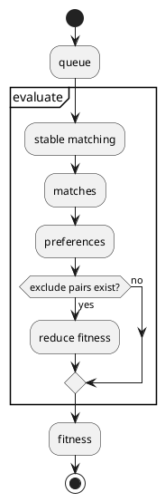
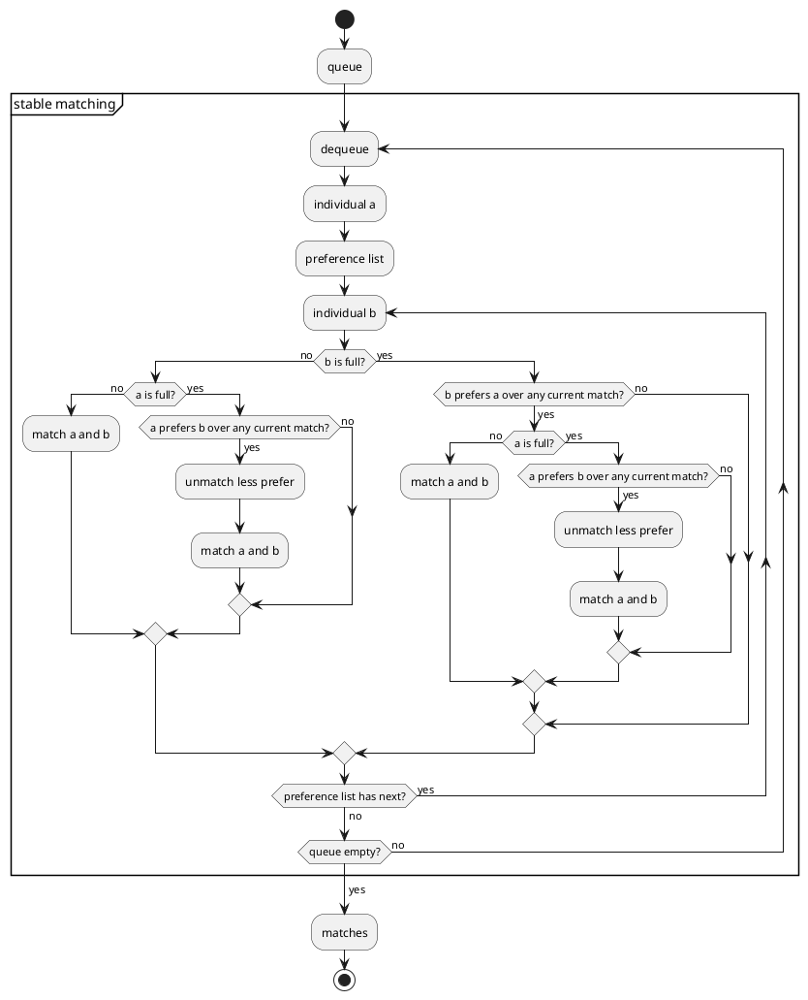
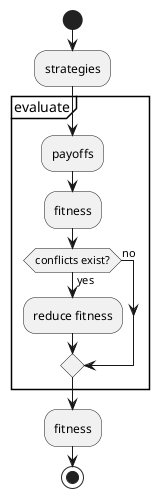

# **1\. Introduction**

### **Introduction**

This application is developed to assist in calculating and finding optimal solutions in Game Theory and Stable Matching Theory problems. Aiming to address the complex issues in these problems, the application applies advanced optimization algorithms such as Genetic Algorithms, which help estimate and achieve accurate results, thereby providing effective solutions for users. The technologies used in the application include: the Java programming language, the Spring Boot Framework (used to build and deploy the backend of the application, supporting the Model-View-Controller architecture), and the MOEA Framework (a library that supports evolutionary optimization algorithms, particularly for multi-objective optimization problems).

The primary goal of this manual is to provide a detailed, easy-to-understand guide for users to effectively utilize the application and make the most of its features. This guide will walk users through the process of installing the application on various operating systems, the system requirements necessary for the application to function, how to create and validate the data forms required for the problems, detailed installation steps, running the application via command-line tools or IDEs, and analyzing the output results. Additionally, the manual offers optimization tips, ways to customize output results to meet user requirements, and troubleshooting common issues during the usage of the application. This ensures that users can maximize the application's performance and achieve highly accurate output results.

# **2\. Table of Contents**
1. [Introduction](#1-introduction)
   - [Introduction](#introduction)   
2. [Table of Contents](#2-table-of-contents)  
3. [Module Specifications](#3-module-specifications)  
   - [SMT (Stable Matching Theory)](#31-smt-stable-matching-theory)  
   - [GT (Game Theory)](#32-gt-game-theory)  
4. [Local Installation](#4-local-installation)  
   - [System Requirements](#41-system-requirements)  
   - [Installation Steps](#42-installation-steps-) 
   - [Troubleshooting](#43-troubleshooting)  
5. [Data Form Creation](#5-data-form-creation)  
6. [Solve](#6-solve)  
   - [Overview](#61-overview)  
   - [ Step-by-step Execution](#62-step-by-step-excution) 
   - [Optimization Tips](#63-optimization-tips)  
7. [Get Result Insight](#7-get-result-insight)
   - [Analyzing Results](#71-analyzing-results)  
   - [Customization](#72-customization) 
   - [Common Issues](#73-common-issues)    
8. [Deployment](#8-deployment)
   - [Supported Environments](#81-supported-environments)  
   - [Deployment Steps](#82-deployment-steps) 
   - [Best Practices](#83-best-pratices)      
9. [Contributors](#9-contributors)  
10. [End](#10-end)

# **3\. Module Specifications**

### **3.1 SMT (Stable Matching Theory)**

The many-to-many variation differs from the original problem defined by Gale and Shapley by introducing individuals' capacity. Therefore, the model is represented in the system as follows:

- Capacities
- Properties
  - Value
  - Weight
  - Requirement
- Set indices
- Exclude pairs
- Evaluate functions
- Fitness function

#### **Evaluate Function**

The **Evaluate function** is specific to individuals within a set, used to compute the preference of one individual over others based on the components of the individual's properties. The details of the calculation are described [preference here].

#### **Exclude Pair**

The **Exclude pair** functionality stops two specific individuals from being matched.

#### **Capacity**

The **Capacity** refers to the maximum number of matches an individual may have.

#### **Fitness Function**

The **Fitness function** calculates the final score from the list of preferences from the matching result. By default, this is the sum of the list.

#### **Set Index**

The **Set index** is a list of integers indicating an individual's set. For example: `[1, 1, 2]` means the 1st and 2nd individuals belong to Set 1, while the 3rd individual belongs to Set 2.

#### **Flow of Event**

With each iteration, a queue of individuals is used to generate stable matching, which is then used to calculate fitness. The order of the queue will be adjusted by the Genetic Algorithm.

### **Stable Matching**

As mentioned, the system expands on the original problem by introducing many-to-many matching. This requires some modification to the Gale-Shapley Algorithm.

## **Preference<<preference>>**

The preference of individual A to individual B is based on 3 factors:

- **Requirement**
- **Value**
- **Weight**

These factors are presented in every property of an individual and are used by the Evaluate function to calculate preference.

---

### Example

| Individual A | Weight | Value | Requirement |
| :----------: | :----: | :---: | :---------: |
|  Property 1  |   12   |  12   |     12      |
|  Property 2  |   13   |  13   |     13      |
|  Property 3  |   23   |  18   |   18:100    |

| Individual B | Weight | Value | Requirement |
| :----------: | :----: | :---: | :---------: |
|  Property 1  |   12   |  12   |     12      |
|  Property 2  |   13   |  13   |     13      |
|  Property 3  |   23   |  18   |   18:100    |

### Common Annotation

- $R_i$ represents the Requirement for Property $i$
- $W_i$ represents the Weight for Property $i$
- $P_i$ represents the Value for Property $i$

Example: $R_1$ means Requirement of Property 1

---

### Custom Evaluation

A custom evaluation function is:

The values of $R_2$ and $W_1$ are taken from Individual A, and $P_1$ is taken from Individual B.

- $W_1$ and $P_1$ are straightforward, while $R_2$ has more nuance.
- The syntax rules give different results for Requirement calculations:

1. $x--$ returns $x$
2. $x:y$ returns $\frac{x + y}{2}$

3. $x++$ returns $x$
4. $x$ returns $x$

Using these rules, the preference of A to B is calculated as:

$13 + 12 * 12 = 157$

---

### Default Evaluation

Default evaluation uses all properties to calculate preference. The formulation can be expressed as:

$$P_A(B) = \sum_{i=1}^{N} R_i(P_i) \times W_i$$

Where:

- $N$ is the number of properties of an individual
- $R_i$ is the requirement function for property $ i $ of A
- $W_i$ is the weight for property $ i $ of A
- $P_i$ is the value for property $ i $ of B

---

### Requirement Functions

1. 
$$
R_i(P_i) = x - - (P_i) =
\begin{cases} 
2 & \text{if } x = 0 \\
0 & \text{if } P_i > x \\
\frac{x + |P_i - x|}{x} & \text{else}
\end{cases}
$$

2. 
$$
R_i(P_i) = x + + (P_i) =
\begin{cases} 
2 & \text{if } x = 0 \\
0 & \text{if } P_i < x \\
\frac{x + |P_i - x|}{x} & \text{else}
\end{cases}
$$

3. 
$$
R_i(P_i) = x : y (P_i) =
\begin{cases} 
\frac{|y - x|}{2} - \frac{|x + y|}{2} + \frac{|P_i|}{|y - x|} + 1 & \text{if } P_i \in [x, y] \\
0 & \text{else}
\end{cases}
$$

4. 
$$
R_i(P_i) = x(P_i) =
\begin{cases} 
0 & \text{if } P_i < 0 \text{ or } P_i > 10 \\
0 & \text{if } |P_i - x| > 7 \\
1 & \text{if } |P_i - x| > 5 \\
\frac{10 - |P_i - x|}{11} & \text{else}
\end{cases}
$$

---

### Apply These Rules

Let’s now apply these rules to calculate the preference of A to B.

$$
P_A(B) = R_1(P_1) * W_1 + R_2(P_2) * W_2 + R_3(P_3) * W_3
$$

Substituting the values from the tables:

This simplifies to:

$$
= \frac{12 + |12 - 12|}{12} * 12 + 0 * 13 + \left( \frac{100 - 18}{2} - \frac{100 + 18}{2} + 1 \right) * 23
$$

Which results in:

$$
= 12 + 0 + 23 = 35
$$

### **3.2 GT (Game Theory)**

As mentioned above, the sole game representation is in **Normal form**, where all players make decisions simultaneously or don't have information about others' decisions. The most notable example is the "Prisoners' Dilemma" problem.

This model is emulated by the system using the provided data:

- Number of players
- Payoff function
- Fitness function
- Special player
- Strategy and their property matrix
- Conflict

After these data are provided to the system, the payoff of each player's strategies are calculated with the payoff function. Note that the same strategy can have different payoffs with different values. It can be interpreted as:

|          | Strategy 1 | Strategy 2 |
| :------: | :--------: | :--------: |
| Player 1 |    100     |     45     |
| Player 2 |     78     |    244     |

Details about how payoffs are calculated are explained in payoff.

_Conflict_ is an additional functionality that discourages any two players from choosing specific strategies at any iteration.

---

### **Flow of Event**

With each iteration, all the players simultaneously make a decision, which has their corresponding payoff. Then the chosen **Genetic Algorithm** will use the fitness function to evaluate the payoffs list.

Here is how fitness is calculated:

### **Payoff <<payoff>>**

The strategies available to any player can be represented as a table as follows:

|            | Property 1 | Property 2 |
| ---------- | ---------- | ---------- |
| Strategy A | 188        | 1.2        |
| Strategy B | 19.7       | 129        |

Payoff is calculated using the payoff function, which defaults to the sum of a strategy's properties or a custom function using the syntax `=p<column index>[<arithmetic>]`. The index starts from 1.

# **4\. Local Installation**

### **4.1 System Requirements**

#### **Hardware Prerequisites**

- CPU: Minimum 2 GHz (multi-core recommended).
- RAM: At least 8GB.
- Disk Space: Minimum 10GB of free storage.

#### **Software Dependencies**

- Java Development Kit (JDK) 17\.
- Maven 3.8.3 or later.
- Git for source code cloning.

### **4.2 Installation Steps**

1. Clone the repository using Git:  
   git clone https://github.com/FitHanuSpecialSubject/GA-Application-Java.git  
   cd GA-Application-Java

2. Build the application:  
   a, Using Maven Wrapper:

- Linux: bash ./mvnw clean install
- Windows: mvnw.cmd clean install

b,Using System Maven: mvn clean install

### **4.3 Troubleshooting**

- **Issue**: Missing dependencies.
  - **Solution**: Run **mvn clean install** to refresh dependencies.
- **Issue**: Incorrect Java version.
  - **Solution**: Verify Java 17 installation and set it as the default.

# **5\. Data Form Creation**

### **Purpose of Data Forms**

Data forms allow users to define and structure the input data required for problem-solving.

### **Instructions for Creating and Validating Forms**

1. Navigate to the data form creation interface.
2. Add fields based on the problem type (e.g., participants, preferences).
3. Validate the form for completeness and consistency.

### **Examples and Best Practices**

- **Stable Matching Example**: Create a form with columns for participants and their ranked preferences.
- Use consistent naming conventions for clarity.

# **6\. Solve**

### **6.1 Overview**

#### **How the Solving Process Works**

- The solver processes the input data and applies algorithms to compute results.
- Supports multiple methodologies such as Genetic Algorithms and Brute Force.

### **6.2 Step-by-Step Execution**

1. Prepare input data using the data form creation tool.
2. Configure the solver with desired parameters (e.g., algorithm type).
3. Execute the solving process via the application or command line.

### **6.3 Optimization Tips**

- Use smaller datasets for initial testing.
- Ensure input data is complete and correctly formatted.

# **7\. Get Result Insight**

### **7.1 Analyzing Results**

- View results in dashboards with charts, tables, and other visual aids.
- Filter data to focus on specific insights.

### **7.2 Customization**

- Adjust result views by applying filters or customizing visual elements.
- Export results in formats like CSV or PDF for further analysis.

### **7.3 Common Issues**

- **Issue**: Missing results.
  - **Solution**: Verify that the solving process completed successfully.
- **Issue**: Misinterpreted data.
  - **Solution**: Refer to the documentation for guidance on result formats.

# **8\. Deployment**

### **8.1 Supported Environments**

- **Local**: Single machine deployment for development or testing.
- **Server**: Deploy to dedicated or virtualized servers.
- **Cloud**: Deploy to platforms like AWS, Azure, or Google Cloud.

### **8.2 Deployment Steps**

1. Build the application using Maven:  
   **`mvn clean package`**
2. Deploy the `.jar` file to the desired environment.
3. Configure environment-specific settings, such as database connections.

### **8.3 Best Practices**

- Secure sensitive information using environment variables or encrypted files.
- Regularly monitor application logs for performance and errors.

# **9\. Contributors**

### **List of Contributors**

- **John Doe**: Backend Developer
- **Jane Smith**: Frontend Developer
- **Alex Nguyen**: Documentation Specialist

### **Acknowledgments**

- **MOEA Framework**: Core solving engine.
- **Spring Framework**: Backend infrastructure

# **10\. End**

### **Final Notes and Disclaimers**

- Ensure the application is used within its intended scope.
- Future updates may change certain functionalities.
