# **1\. Introduction**


This application is developed to assist in calculating and finding optimal solutions in Game Theory and Stable Matching Theory problems. Aiming to address the complex issues in these problems, the application applies advanced optimization algorithms such as Genetic Algorithms, which help estimate and achieve accurate results, thereby providing effective solutions for users. The technologies used in the application include: the Java programming language, the Spring Boot Framework (used to build and deploy the backend of the application, supporting the Model-View-Controller architecture), and the MOEA Framework (a library that supports evolutionary optimization algorithms, particularly for multi-objective optimization problems).

The primary goal of this manual is to provide a detailed, easy-to-understand guide for users to effectively utilize the application and make the most of its features. This guide will walk users through the process of installing the application on various operating systems, the system requirements necessary for the application to function, how to create and validate the data forms required for the problems, detailed installation steps, running the application via command-line tools or IDEs, and analyzing the output results. Additionally, the manual offers optimization tips, ways to customize output results to meet user requirements, and troubleshooting common issues during the usage of the application. This ensures that users can maximize the application's performance and achieve highly accurate output results.

# **2\. Table of Contents**

1. [Introduction](#1-introduction)
2. [Table of Contents](#2-table-of-contents)
### A. System Setup Overview:
3. [Local Installation](#3-local-installation) ([Link Google Drive hướng dẫn](https://drive.google.com/drive/folders/1LAf5cdsjDVBJT-gzQGw6fIyd2YOD3e-f))
4. [Solve](#4-solve)
   - [Step-by-step Execution](#41-step-by-step--excution)
   - [Optimization Tips](#42-optimization-tips)
5. [Get Result Insight](#5-get-result-insight)
   - [Analyzing Results](#51-analyzing-results)
   - [Output Format](#52-output-format)
   - [Common Issues](#53-common-issues)
6. [Deployment](#6-deployment)
   - [Supported Environments](#61-supported-environments)
   - [Deployment Steps](#62-deployment-steps)
   - [Best Practices](#63-best-practices)
### B. Algorithmic Design and Data Collection:
7. [Module Specifications](#7-module-specifications)
   - [SMT (Stable Matching Theory)](#71-smt-stable-matching-theory)
   - [GT (Game Theory)](#72-gt-game-theory)
8. [Data Form Creation](#8-data-form-creation)

9. [Contributors](#9-contributors)
10. [End](#10-end)
# **3\. Local Installation**

### Compatibility and Testing

If result not present, please test on your system and give feedback.

| Platforms | Versions/ Distro | Status  | Note                                |
| --------- | ---------------- | ------- | ----------------------------------- |
| Windows   | 10               | N/A     | Untested                            |
|           | 11               | Working | Tested                              |
| WSL       | Ubuntu           | Working | -PwithFront stuck on unpacking node |
| Linux     | Ubuntu           | Working | Tested, Deployed                    |
|           | Debian           | N/A     | Untested                            |
| Mac       | N/A              | N/A     | Untested                            |

### Requirements

1. git
2. JDK 17 (Temurin/ OpenJDK)
3. Maven 3.8.3+ (or use wrapper in project)

### Steps

1. Clone the repository

```bash
git clone https://github.com/FitHanuSpecialSubject/GA-Application-Java.git
```
2. Change directory to GA-Application-Java folder
```bash
cd GA-Application-Java
```
3. Build the project

#### Using project maven wrapper (recommended):

- Linux

```bash
bash ./mvnw clean install
```

- Windows

```bash
.\mvnw.cmd clean install
```

- Using system maven (require installation)

#### maven setup instruction: [How to install maven Win, Mac, Linux](https://www.baeldung.com/install-maven-on-windows-linux-mac)

```bash
mvn clean install
```

### (Optional) Install with webapp

#### Clone & Install FE application via maven profile

```bash
mvn clean install -PwithFront
```

## Usage

### Backend run

- Run via maven profile

```bash
mvn verify -DskipTests -PstartBE
```

- Run the generated .jar file from the build project step. (recommended)

```bash
java -jar target/[generated_application_filename].jar
```

- Or use modern Java IDE like IntelliJ IDEA, Eclipse, Netbeans, ... to run with IDE preconfigures

- Expected output:
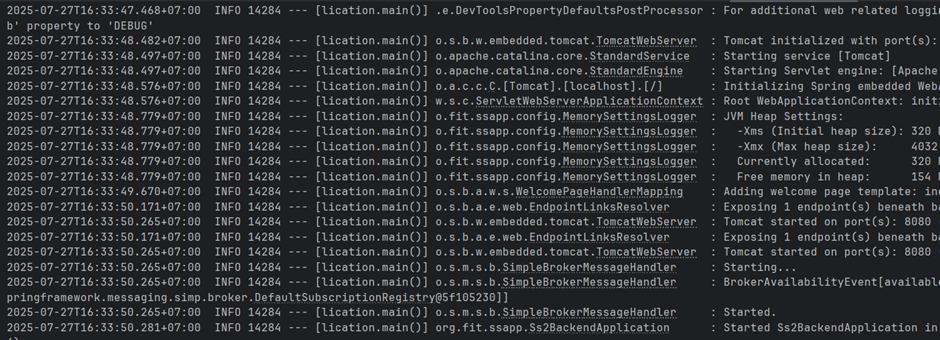
To verify that the backend is running correctly, open `localhost:8080` in your web browser. The expected output is shown below:

  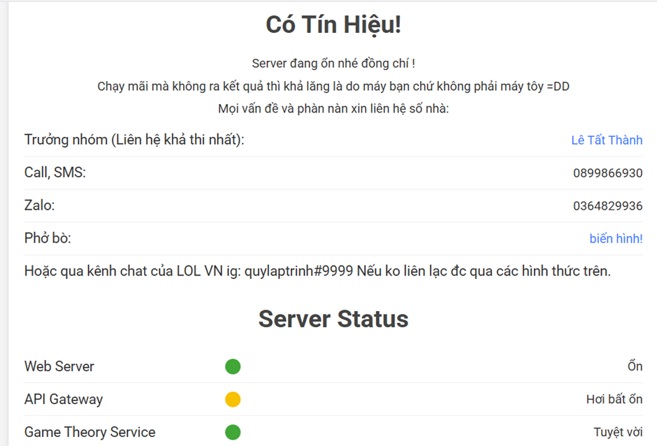
### Webapp run via maven (for a quick demo via terminal)

```bash
mvn verify -DskipTests -Dskip.node-and-npm.install -PstartFE
```

- Separate process with BE
- Might need to kill process manually after closing, `npx cross-port-killer 3000` could do.

Web application server will start at localhost:3000 using `npx serve` with static resources generated by `npx react-scripts build`

# **4\. Solve**

The solver processes the input data and applies algorithms to compute results.

### **4.1 Step-by-Step Execution**

1. Prepare input data form, then upload this file.

2. Configure the solver
   - Select a algorithm, problem type.
   - Configure algorithm parameters, likes: Number of distributed cores, Population size, Number of crossover generation, Optimizatiob execution max time.
3. Click the "Solve now" button to start the process and wait for the results.
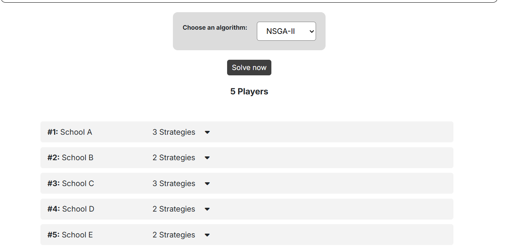

### **4.2 Optimization Tips**
- Use smaller datasets for initial testing.
- Ensure input data is complete,syntax-corrected and correctly formatted.

# **5\. Get Result Insight**

_The "Get Result Insight" feature will be available after a successful solve._

### **5.1 Analyzing Results**

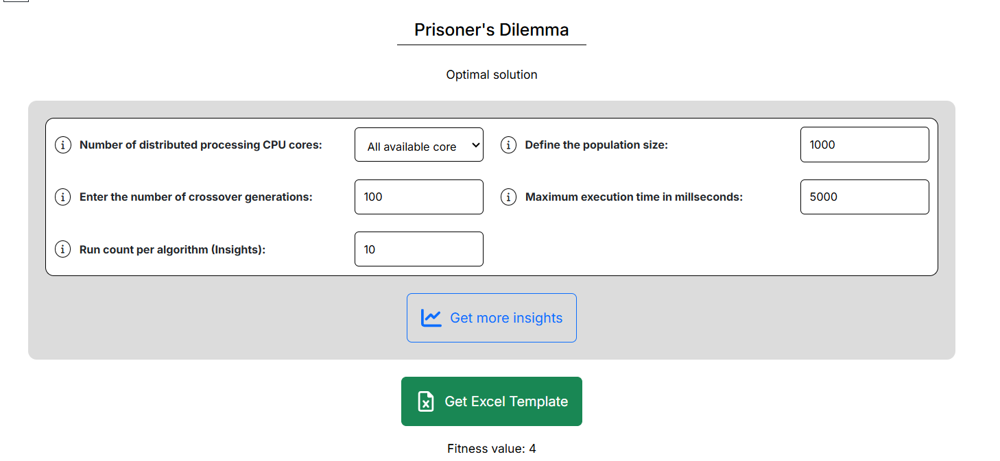

- "Get Result Insight" will run 6 algorithms, each executing 10 times.
- Estimated completion time = average runtime of one algorithm _ number of executions per algorithm _ number of algorithms. **So That**: The runtime of getInsight may be very long, and users should not close the tab or shut down the computer, as it will result in a lost session.
- After running GetInsight, users can export results and images using the "Export" feature.
  - View results in dashboards with charts, tables, and other visual aids.
  - Filter data to focus on specific insights

### **5.2 Output Format**

- **SMT**: A table containing matched pairs and unmatched pairs (if any).
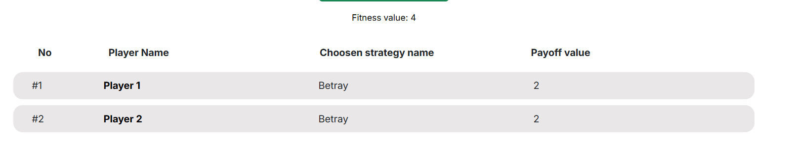
- **GT**: A table containing the strategies used and the corresponding scores of the players.
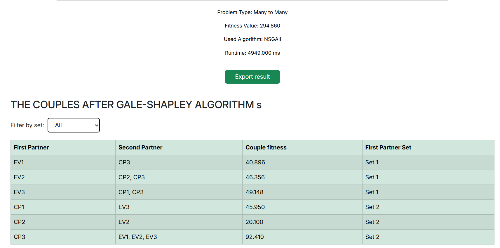
# **6\. Deployment**
# **7\. Module Specifications**

### **7.1 SMT (Stable Matching Theory)**
A stable matching is a fundamental concept in mathematics, economics, and computer science that describes a particular way of pairing elements from two distinct sets based on their individual preferences. In essence, it is a matching of participants where there is no incentive for any pair of individuals to break their assigned partnerships to form a new one.
The core principle of a stable matching lies in the idea of avoiding "instability." An instability, often referred to as a blocking pair, occurs when two individuals who are not matched with each other would both prefer to be with each other than their current partners.
#### **Types of Problems**

- **MTM (Many-to-Many)**: Each individual (from two distinct sets) can have multiple matches.
    - **Example:** A group of freelancers and a group of companies. A freelancer can work for multiple companies, and a
      company can hire multiple freelancers.
- **OTM (One-to-Many)**: One individual from a set can have multiple matches, but each other individual in the opposite set can only be matched once.
    - **Example:** A group of professors and a group of students. A professor can advise multiple students, but each
      student can only have one advisor.
- **OTO (One-to-One)**: This is the standard Gale-Shapley problem where each individual in both sets is matched with exactly one individual from the opposite set.
    - **Example:** A group of people and a group of cars. Each person can buy one car, and each car can only be sold to one person.

| Name                          | Explanation                                                                               | Data Type | Notes                          |
| ----------------------------- | ----------------------------------------------------------------------------------------- | --------- | ------------------------------ |
| **Problem name**              | The name is taken from the data entered by the user.                                      | text      |                                |
| **Number of set**             | The number of participating sets is taken from the user input.                            | int       | must be >= 2                   |
| **Number of individuals**     | The total number of individuals in each participating set.                                | int       | must be >3                     |
| **Number of characteristics** | The total number of attributes of the participating individuals.                          | int       |                                |
| **Fitness function**          | A function that evaluates the suitability or effectiveness of an individual in the model. | text      | Exact formula or default value |
| **Evaluate Function Set_1**   | The first set of evaluation functions used to assess individuals.                         | text      | Exact formula or default value |
| **Evaluate Function Set_2**   | The second set of evaluation functions, which may use different criteria.                 | text      | Exact formula or default value |


#### **Example of a Problem Information Sheet:**
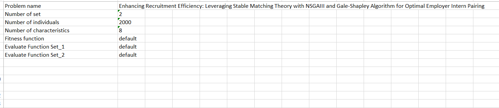

#### **Exclude Pair**

The **Exclude pair** functionality allows for the exclusion of specific pairs from being matched, even if they would otherwise have a high preference score.
#### **Properties of Each Individual**

- **Set indices**
- **Capacity**: Each individual can have a defined capacity, which restricts the number of matches they can participate in. 
- **PWR (Properties)**:
  - **Value**: Represents a numerical or qualitative measure of the individual’s importance or suitability in the matching process. For example, A job applicant's `Value` could be their GPA, or a company's `Value` could be its average salary offering.
  - **Weight**: Represents the relative importance or priority of that individual in the matching decision. For example, A company might have a higher `Weight` than a new startup, meaning the algorithm prioritizes matching applicants to that company.
  - **Requirement**: The minimum necessary requirements that an individual must have to be considered for a match. For example, a job opening might have a `Requirement` for 3 years of experience.
  

#### **Flow of Event**

With each iteration, a queue of individuals is used to generate stable matching, which is then used to calculate fitness. The order of the queue will be adjusted by the Genetic Algorithm.

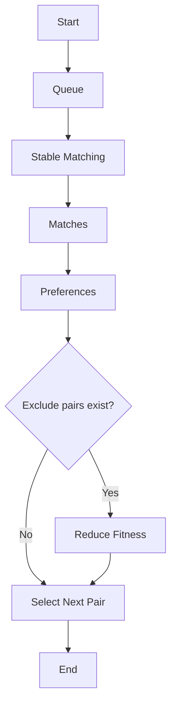

### **Core Stable Matching**

As mentioned, the system expands on the original problem by introducing many-to-many matching. This requires some modification to the Gale-Shapley Algorithm.

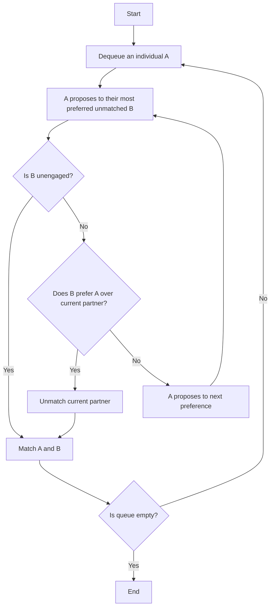

### **7.2 GT (Game Theory)**


- Game theory is a branch of mathematics that studies the interactions between rational decision-makers, often modeled as players in a game. The goal of game theory is to understand how people make decisions in strategic situations where the outcome of a decision depends on the actions of others. Here, the sole game representation is in **Normal form**, where all players make decisions simultaneously or don't have information about others' decisions.

  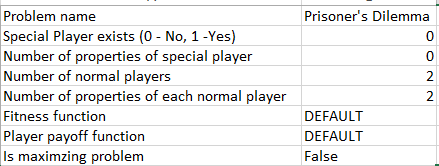
1. **Problem Information**

| Name                                           | Explanation                                                                                                                       | Data Type | Example                          |
| ---------------------------------------------- | --------------------------------------------------------------------------------------------------------------------------------- | --------- | ------------------------------ |
| **Problem name**                               | The name is taken from the data entered by the user.                                                                              | text      |  Market Entry Game                              |
| **Special Player exists**                      | Determines whether a special player exists (0: No, 1: Yes). The special player may have a significant or unique role in the game. | int       | 0 or 1                         |
| **Number of properties of special player**     | The number of characteristics or attributes of the special player.                                                                | int       |           2, 3, ...                     |
| **Number of normal players**                   | The total number of regular players in the game.                                                                                  | int       |   5, 10, ...                             |
| **Number of properties of each normal player** | The number of attributes for each normal player, which may relate to strategies, resources, or benefits.                          | int       | 2, 3...                               |
| **Fitness function**                           | A function that evaluates the success of a player.                                                                                | text      | Exact formula or default value |
| **Player payoff function**                     | A function that determines the rewards or benefits a player receives based on their strategies and actions.                       | text      | Exact formula or default value |
| **Is maximizing problem**                      | Specifies whether the problem is a maximization problem.                                                                          | boolean   | true or false                  |


After these data are provided to the system, the payoff of each player's strategies are calculated with the payoff function. Note that the same strategy can have different payoffs with different values.

  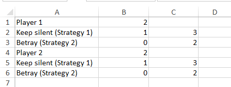

In this table, the values represent the payoffs for Player 1 and Player 2 for each combination of strategies in the Prisoners Dilemma problem. For example, if both player chooses Strategy 1 (Keep silent), both player receives a payoff value of 1. If Player 1 chooses Strategy 1 (Keep silent) and player 2 chooses Strategy 2 (Betray), player 1 receives a payoff value of 3 and player 2 receives a payoff value of 0.

---

2. **Flow of Event**

With each iteration, all the players simultaneously make a decision, which has their corresponding payoff. Then the chosen **Genetic Algorithm** will use the fitness function to evaluate the payoffs list.

Here is how fitness is calculated:

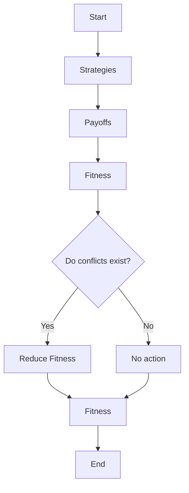


# **8. Data Form Creation**
**[Video Tutorial](https://drive.google.com/drive/folders/16e0t3Vhkr4Bc85k0Bd_aFFTEpU6s_s9R?usp=drive_link)**

### **Purpose of the Data Form**
The Data Form allows users to define and structure input data for solving various problems effectively. There are two types of data forms: SMT data form and GT data form. Each type has its own specific requirements for input formatting and structure to ensure accurate and efficient problem-solving.

#

## 8.1. **SMT (Stable Matching Theory)**

The data form requires users to input a list of participants along with their ranked preferences. Each participant must have a complete and correctly ordered preference list to maintain consistency and fairness in the matching process.

### 8.1.1. **Sheet Naming**
- Must include: "Problem Info", "Dataset".  
- Note: Use the exact sheet names to avoid errors.  

### 8.1.2. **Problem Information**

| Name | Description | Data Type | Notes |
|------|-------------|-----------|-------|
| **Problem name** | The name provided by the user. | text | |
| **Number of sets** | Total number of sets involved. | int | Must be ≥ 2 |
| **Number of individuals** | Total individuals in each set. | int | Must be > 3 |
| **Number of characteristics** | Total attributes of individuals. | int | |
| **Fitness function** | Function to evaluate suitability/effectiveness of an individual. | text | Formula or default |
| **Evaluate Function Set_1** | First evaluation function set for individuals. | text | Formula or default |
| **Evaluate Function Set_2** | Second evaluation function set (optional criteria). | text | Formula or default |
### Example
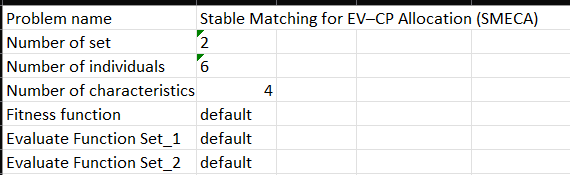
### 8.1.3. **Problem Data (Dataset)**
**Components**  
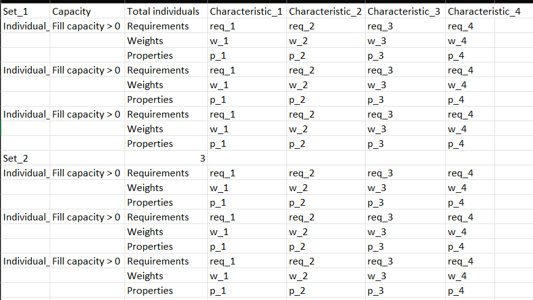

| Name                          | Description                                                                                   | Data Type | Notes                                                                 |
| ----------------------------- | --------------------------------------------------------------------------------------------- | --------- | --------------------------------------------------------------------- |
| **Set_1**                     | The name of the set or group containing individuals.                                           | text      | Example: "Set_1", "Set_2"                                             |
| **Capacity**                  | The maximum capacity of each object.                                                           | int       | Must be > 0, enter directly in the “fill capacity > 0” field          |
| **Total individuals**         | The maximum number of individuals in each set.                                                 | int       | Must be > 0, enter immediately to the right of the capacity field     |
| **Individual_1**              | The name of a participant in the set.                                                          | text      | Required if Capacity > 0                                              |
| **Requirements, Weights, Properties** | The attributes (requirements, weights, values) used in the Gale-Shapley algorithm. |           | **DO NOT MODIFY THIS DATA**                                           |
| **req_1 ... req_k**           | Values of requirements.                                                                        | text / logical expression |                                                                       |
| **w_1 ... w_k**               | Values of weights.                                                                             | int       | Must be ≥ 0                                                           |
| **p_1 ... p_k**               | Values of properties (values).                                                                 | double    | Must be ≥ 0                                                           |
### Example

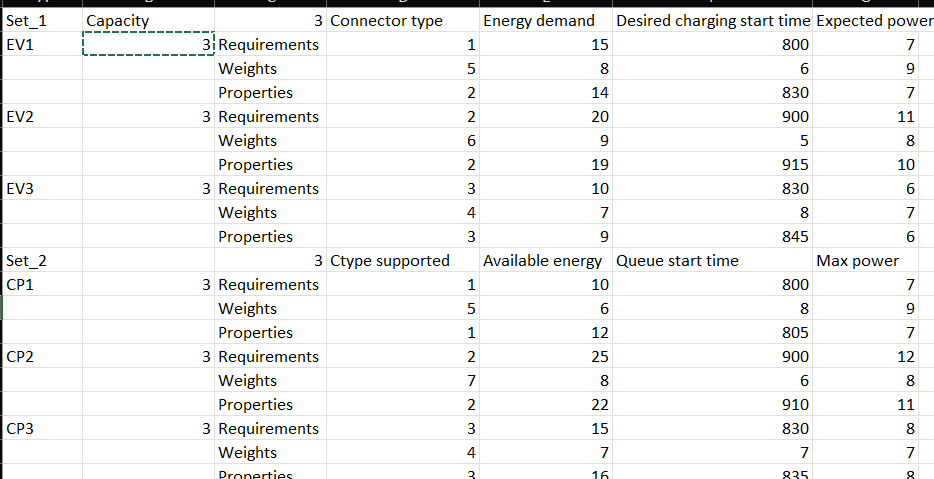

---

## 8.2. **GT (Game Theory)**

The data form consists of defining the number of players, their available strategies, and a corresponding payoff matrix. This ensures that the system can accurately compute optimal strategies and outcomes based on the input data. 

### 8.2.1. **Sheet Naming**
- Must include: "Problem Info", "Normal player"(add a sheet of "Special player" if you need).  
- Note: Use the exact sheet names to avoid errors.  

### 8.2.2. **Problem Information**

| Name | Description | Data Type | Notes |
|------|-------------|-----------|-------|
| **Problem name** | User-provided name. | text | |
| **Special Player exists** | 0: No, 1: Yes. | int | 0 or 1 |
| **Number of properties of special player** | Number of attributes of the special player. | int | |
| **Number of normal players** | Total normal players. | int | |
| **Number of properties of each normal player** | Number of attributes per normal player. | int | |
| **Fitness function** | Evaluates player success. | text | Formula or default |
| **Player payoff function** | Determines reward/payoff per strategy. | text | Formula or default |
| **Is maximizing problem** | Whether the problem is maximization. | boolean | true/false |

### Example


### 8.2.3. **Problem Data( Normal player/Special player)**

**Components**


| Name | Description | Data Type | Notes |
|------|-------------|-----------|-------|
| **Player_name** | Player’s name (default: “Player n”). | text | Optional |
| **Number_of_strategies** | Strategies per player. | int | ≥ 1 |
| **Payoff_function** | Custom payoff function. | text | Default = sum(properties) |
| **Strategy_name** | Strategy label. | text | e.g. "S1" |git br
| **Property_1 ... property_n** | Strategy quantitative attributes. | double | ≥ 0 |
### Example


# **9\. Contributors**

### **List of Contributors**
**Team code SS2**
- **Backend Developer**
- **Frontend Developer**
- **Business Analyst**

### **Acknowledgements**

- **MOEA Framework**: Core solving engine.
- **Spring Framework**: Backend infrastructure

# **10\. End**

### **Final Notes and Disclaimers**

If you run into any issues or have questions while using it, just reach out to the SS2 coding team for help!

