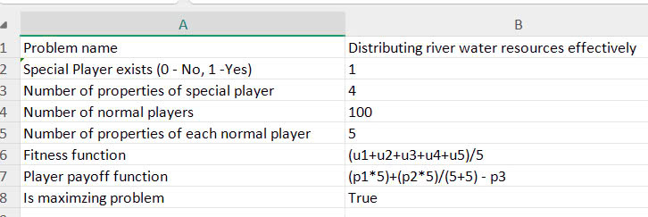
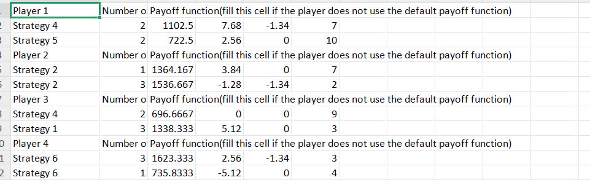

# **1\. Introduction**

### **Introduction**

This application is developed to assist in calculating and finding optimal solutions in Game Theory and Stable Matching Theory problems. Aiming to address the complex issues in these problems, the application applies advanced optimization algorithms such as Genetic Algorithms, which help estimate and achieve accurate results, thereby providing effective solutions for users. The technologies used in the application include: the Java programming language, the Spring Boot Framework (used to build and deploy the backend of the application, supporting the Model-View-Controller architecture), and the MOEA Framework (a library that supports evolutionary optimization algorithms, particularly for multi-objective optimization problems).

The primary goal of this manual is to provide a detailed, easy-to-understand guide for users to effectively utilize the application and make the most of its features. This guide will walk users through the process of installing the application on various operating systems, the system requirements necessary for the application to function, how to create and validate the data forms required for the problems, detailed installation steps, running the application via command-line tools or IDEs, and analyzing the output results. Additionally, the manual offers optimization tips, ways to customize output results to meet user requirements, and troubleshooting common issues during the usage of the application. This ensures that users can maximize the application's performance and achieve highly accurate output results.

# **2\. Table of Contents**

1. [Introduction](#1-introduction)
2. [Table of Contents](#2-table-of-contents)
3. [Module Specifications](#3-module-specifications)
   - [SMT (Stable Matching Theory)](#31-smt-stable-matching-theory)
   - [GT (Game Theory)](#32-gt-game-theory)
4. [Local Installation](#4-local-installation)
5. [Data Form Creation](#5-data-form-creation)
6. [Solve](#6-solve)
   - [Step-by-step Execution](#61-step-by-step--excution)
   - [Optimization Tips](#62-optimization-tips)
7. [Get Result Insight](#7-get-result-insight)
   - [Analyzing Results](#71-analyzing-results)
   - [Output Format](#72-output-format)
   - [Common Issues](#73-common-issues)
8. [Deployment](#8-deployment)
   - [Supported Environments](#81-supported-environments)
   - [Deployment Steps](#82-deployment-steps)
   - [Best Practices](#83-best-practices)
10. [Contributors](#9-contributors)
11. [End](#10-end)

# **3\. Module Specifications**

### **3.1 SMT (Stable Matching Theory)**

#### **Types of Problems**

- **MTM (Many-to-Many)**: Each individual (from two distinct sets) can have multiple matches.
- **OTM (One-to-Many)**: One individual from a set can have multiple matches, but each other individual in the opposite set can only be matched once.
- **OTO (One-to-One)**: This is the standard Gale-Shapley problem where each individual in both sets is matched with exactly one individual from the opposite set.

#### **Evaluate Function**

The **Evaluate function** is specific to individuals within a set, used to compute the preference of one individual over others based on the components of the individual's properties.

#### **Fitness Function**

The **Fitness function** evaluates the final result of the matching process. It calculates how good or "fit" a matching is based on the preferences of the matched pairs. By default, this is the sum of the list.

#### **Exclude Pair**

The **Exclude pair** functionality allows for the exclusion of specific pairs from being matched, even if they would otherwise have a high preference score.

#### **Capacity**

The **Capacity** refers to the maximum number of matches an individual may have.

#### **Properties of Each Individual**

- **Set indices**
- **Capacity**: Each individual can have a defined capacity, which restricts the number of matches they can participate in.
- **PWR (Properties)**:
  - **Value**: Represents a numerical or qualitative measure of the individual’s importance or suitability in the matching process.
  - **Weight**: Represents the relative importance or priority of that individual in the matching decision.
  - **Requirement**: The minimum necessary requirements that an individual must have to be considered for a match.

#### **Flow of Event**

With each iteration, a queue of individuals is used to generate stable matching, which is then used to calculate fitness. The order of the queue will be adjusted by the Genetic Algorithm.


### **Core Stable Matching**

As mentioned, the system expands on the original problem by introducing many-to-many matching. This requires some modification to the Gale-Shapley Algorithm.


### **3.2 GT (Game Theory)**

The sole game representation is in **Normal form**, where all players make decisions simultaneously or don't have information about others' decisions.

1. **Problem Information**

- **Pyoff function**: This function calculates the payoff (or reward) that each player receives based on their chosen strategy and the strategies chosen by other players. Payoff calculations will depend on the interactions between these strategies. Define how to calculate payoff from a player strategy. It should be note that
  this function will be the default for any player without their own payoff function.
- **Fitness function**: A function that evaluates how good or optimal a player's strategy is, typically by assessing the payoff values generated by the chosen strategies.
- **Special player**: A player who may have additional constraints or capabilities, differentiating them from other players.
- **Strategy and their property matrix**: A table representing all the strategies available to the players along with the properties or attributes of each strategy.
- **Conflict**: A functionality that can prevent or discourage players from choosing specific strategies at any iteration of the game.

After these data are provided to the system, the payoff of each player's strategies are calculated with the payoff function. Note that the same strategy can have different payoffs with different values.

|          | Strategy 1 | Strategy 2 |
| :------: | :--------: | :--------: |
| Player 1 |    100     |     45     |
| Player 2 |     78     |    244     |

In this table, the values represent the payoffs for Player 1 and Player 2 for each combination of strategies. For example, if Player 1 chooses Strategy 1 and Player 2 chooses Strategy 2, Player 1 receives a payoff of 100, and Player 2 receives a payoff of 78.

---

2. **Flow of Event**

With each iteration, all the players simultaneously make a decision, which has their corresponding payoff. Then the chosen **Genetic Algorithm** will use the fitness function to evaluate the payoffs list.

Here is how fitness is calculated:


# **4\. Local Installation**

### Compatibility and Testing

If result not present, please test on your system and give feedback.

| Platforms | Versions/ Distro | Status  | Note                                |
| --------- | ---------------- | ------- | ----------------------------------- |
| Windows   | 10               | N/A     | Untested                            |
|           | 11               | Working | Tested                              |
| WSL       | Ubuntu           | Working | -PwithFront stuck on unpacking node |
| Linux     | Ubuntu           | Working | Tested, Deployed                    |
|           | Debian           | N/A     | Untested                            |
| Mac       | N/A              | N/A     | Untested                            |

### Requirements

1. git
2. JDK 17 (Temurin/ OpenJDK)
3. Maven 3.8.3+ (or use wrapper in project)

### Steps

1. Clone the repository

```bash
git clone https://github.com/FitHanuSpecialSubject/GA-Application-Java.git
cd GA-Application-Java
```

2. Build the project

#### Using project maven wrapper (recommended):

- Linux

```bash
bash ./mvnw clean install
```

- Windows

```bash
mvnw.cmd clean install
```

- Using system maven (require installation)

#### maven setup instruction: [How to install maven Win, Mac, Linux](https://www.baeldung.com/install-maven-on-windows-linux-mac)

```bash
mvn clean install
```

### (Optional) Install with webapp

#### Clone & Install FE application via maven profile

```bash
mvn clean install -PwithFront
```

## Usage

### Backend run

- Run via maven profile

```bash
mvn verify -DskipTests -PstartBE
```

- Run the generated .jar file from the build project step. (recomended)

```bash
java -jar target/[generated_application_filename].jar
```

- Or use modern Java IDE like IntelliJ IDEA, Eclipse, Netbeans, ... to run with IDE preconfigures

### Webapp run via maven (for a quick demo via terminal)

```bash
mvn verify -DskipTests -Dskip.node-and-npm.install -PstartFE
```

- Separate process with BE
- Might need to kill process manually after closing, `npx cross-port-killer 3000` could do.

Web application server will start at localhost:3000 using `npx serve` with static resources generated by `npx react-scripts build`

# **5\. Data Form Creation**

### **Purpose of Data Forms**

The Data Form allows users to define and structure input data for solving various problems effectively. There are two types of data forms: SMT data form and GT data form. Each type has its own specific requirements for input formatting and structure to ensure accurate and efficient problem-solving.

## 5.1. **Stable Matching Theory**

The data form requires users to input a list of participants along with their ranked preferences. Each participant must have a complete and correctly ordered preference list to maintain consistency and fairness in the matching process.

#### 5.1.1. **Sheet naming**

- It's include: "Problem Info", "Problem Data".
- Note: Name the sheet correctly, or an error will occur.

#### 5.1.2. **Problem information**

| Name                          | Explanation                                                                               | Data Type | Notes                          |
| ----------------------------- | ----------------------------------------------------------------------------------------- | --------- | ------------------------------ |
| **Problem name**              | The name is taken from the data entered by the user.                                      | text      |                                |
| **Number of set**             | The number of participating sets is taken from the user input.                            | int       | must be >= 2                   |
| **Number of individuals**     | The total number of individuals in each participating set.                                | int       | must be >3                     |
| **Number of characteristics** | The total number of attributes of the participating individuals.                          | int       |                                |
| **Fitness function**          | A function that evaluates the suitability or effectiveness of an individual in the model. | text      | Exact formula or default value |
| **Evaluate Function Set_1**   | The first set of evaluation functions used to assess individuals.                         | text      | Exact formula or default value |
| **Evaluate Function Set_2**   | The second set of evaluation functions, which may use different criteria.                 | text      | Exact formula or default value |

#### 5.1.3. **Problem data**

**Components**


**How to input values?**

The preference of individual A to individual B is based on 3 factors:

- **Requirement**
- **Value**
- **Weight**

These factors are presented in every property of an individual and are used by the Evaluate function to calculate preference.

---

### Example

| Individual A | Weight | Value | Requirement |
| :----------: | :----: | :---: | :---------: |
|  Property 1  |   10   |  11   |     12      |
|  Property 2  |   7    |  13   |     13      |
|  Property 3  |   5    |  18   |   18:100    |

| Individual B | Weight | Value | Requirement |
| :----------: | :----: | :---: | :---------: |
|  Property 1  |   3    |  12   |     12      |
|  Property 2  |   8    |  13   |     13      |
|  Property 3  |   6    |  18   |   18:100    |

### Rules for properties

- Value $>=$ 0
- Value must be greater than 0
- Requirement can either be a positive number (used in custom calculations) or a string (such as "1 bound", "2 bounds", or "scale target") (used in default calculations).

### Common Annotation

- $R_i$ represents the Requirement for Property $i$
- $W_i$ represents the Weight for Property $i$
- $P_i$ represents the Value for Property $i$

Example: Custom function in Individual A: ($P_1$ - $R_1$) ^ $W_1$

$P_1$ is the Value of Property 1: 11  
$R_1$ is the Requirement of Property 1: 12  
$W_1$ is the Weight of Property 1 :10

Result is: ($P_1$ - $R_1$) ^ $W_1$ = ($11$-$10$) ^ $12$ = $1$

---

### Custom Evaluation

A custom evaluation function is:

The values of $R_2$ and $W_1$ are taken from Individual A, and $P_1$ is taken from Individual B.

- $W_1$ and $P_1$ are straightforward, while $R_2$ has more nuance.
- The syntax rules give different results for Requirement calculations:

1. $x--$ returns $x$
2. $x:y$ returns $\frac{x + y}{2}$

3. $x++$ returns $x$
4. $x$ returns $x$

Using these rules, the preference of A to B is calculated as:

$12 + 11 * 12 = 144$

---

### Default Evaluation

Default evaluation uses all properties to calculate preference. The formulation can be expressed as:

$$P_A(B) = \sum_{i=1}^{N} R_i(P_i) \times W_i$$

Where:

- $N$ is the number of properties of an individual
- $R_i$ is the requirement function for property $i$ of A
- $W_i$ is the weight for property $i$ of A
- $P_i$ is the value for property $i$ of B

---

### Requirement Functions

1.  
$$
    R_i(P_i) = x - - (P_i) =
    \begin{cases}
    2 & \text{if } x = 0 \\
    0 & \text{if } P_i > x \\
    \frac{x + |P_i - x|}{x} & \text{else}
    \end{cases}
    $$

2.  
$$
    R_i(P_i) = x + + (P_i) =
    \begin{cases}
    2 & \text{if } x = 0 \\
    0 & \text{if } P_i < x \\
    \frac{x + |P_i - x|}{x} & \text{else}
    \end{cases}
    $$

3.  
$$
    R_i(P_i) = x : y (P_i) =
    \begin{cases}
    \frac{|y - x|}{2} - \frac{|x + y|}{2} + \frac{|P_i|}{|y - x|} + 1 & \text{if } P_i \in [x, y] \\
    0 & \text{else}
    \end{cases}
    $$

4.  
$$
    R_i(P_i) = x(P_i) =
    \begin{cases}
    0 & \text{if } P_i < 0 \text{ or } P_i > 10 \\
    0 & \text{if } |P_i - x| > 7 \\
    1 & \text{if } |P_i - x| > 5 \\
    \frac{10 - |P_i - x|}{11} & \text{else}
    \end{cases}
    $$

---

### Apply These Rules

Let’s now apply these rules to calculate the preference of A to B.

$$
P_A(B) = R_1(P_1) * W_1 + R_2(P_2) * W_2 + R_3(P_3) * W_3
$$

Substituting the values from the tables:

This simplifies to:

$$
= \frac{12 + |12 - 12|}{12} * 12 + 0 * 13 + \left( \frac{100 - 18}{2} - \frac{100 + 18}{2} + 1 \right) * 23
$$

Which results in:

$$
= 12 + 0 + 23 = 35
$$

**How to enter function syntax?**

- Syntax

  - $: i - index of MatchSet in "matches"

    - $: set - value (1 or 2) represent set 1 (0) or set 2 (1)
    - $: S(set) - Sum of all payoff scores of "set" evaluate by opposite set
    - $: M(i) - Value of specific matchSet's satisfaction eg: M0 (satisfactory of Individual no 0)
      _ Supported functions:
      _ #: SIGMA{S1} calculate sum of all MatchSet of a belonging set eg: SIGMA{S1}

          * Supported mathematical calculations:
          * Name:    Usage
          * 1. absolute       : abs(expression)
          * 2. exponent      : (expression)^(expression)
          * 3. sin                 : sin(expression)
          * 4. cos                 : cos(expression)
          * 5. tan                : tan(expression)
          * 6. logarithm     : log(expression)(expression)
          * 7. square root: sqrt(expression)

- Note: User can fill "Default" in the function.

## 5.2. **Game Theory**

The data form consists of defining the number of players, their available strategies, and a corresponding payoff matrix. This ensures that the system can accurately compute optimal strategies and outcomes based on the input data.

#### 5.2.1. **Sheet naming**

- It's include: "Problem Info", "Problem Data".
- Note: Name the sheet correctly, or an error will occur.

#### 5.2.2. **Problem Information**

| Name                                           | Explanation                                                                                                                       | Data Type | Notes                          |
| ---------------------------------------------- | --------------------------------------------------------------------------------------------------------------------------------- | --------- | ------------------------------ |
| **Problem name**                               | The name is taken from the data entered by the user.                                                                              | text      |                                |
| **Special Player exists**                      | Determines whether a special player exists (0: No, 1: Yes). The special player may have a significant or unique role in the game. | int       | 0 or 1                         |
| **Number of properties of special player**     | The number of characteristics or attributes of the special player.                                                                | int       |                                |
| **Number of normal players**                   | The total number of regular players in the game.                                                                                  | int       |                                |
| **Number of properties of each normal player** | The number of attributes for each normal player, which may relate to strategies, resources, or benefits.                          | int       |                                |
| **Fitness function**                           | A function that evaluates the success of a player.                                                                                | text      | Exact formula or default value |
| **Player payoff function**                     | A function that determines the rewards or benefits a player receives based on their strategies and actions.                       | text      | Exact formula or default value |
| **Is maximizing problem**                      | Specifies whether the problem is a maximization problem.                                                                          | boolean   | true or false                  |

  **Example here**  
  

#### 5.2.3. **Problem Data**

**Components**

Example here 




**How to input values?**

- Players:

  - The stage game is represented in standard strategic (normal) form.
  - The set of players is denoted by $I = {1, ..., n}$.
  - Each player $i ∈ I$ has an action set denoted by **$A_{i}$**.
  - An action profile **$a$ $=$ ($ai$, $a_{-i}$)** consists of the action of player **i** and the actions of the other players, denoted by **$a_{-i}$ = ($a{1}$,..., $a{n}$) ∈ $A_{-i}$**.

- Strategies:

  - A strategy **$s_i$ ∈ $S_i$** for player **i**, then a function **$s_i$: H $\to$ $A_{i}$**, where the strategy space of **i** consists of **$K_{i}$** discrete strategies: that is, **$S_i = {s_i^1,s_i^1, ..., s_i^{K_{i}} }$**
  - Futhermore, denote a strategy combination of the **n** players except **$i$** by **$s_{-i}$ = ($s{1}$,..., $s{n}$)**
  - The set of joint-strategy profiles is denoted by **$S$ = $S_{1}$ x ... x $S_{n}$**

  Each player **i** has a payoff function **$\pi_{i}$: S $\to$ R**, which represents the payoff when the joint-strategy profile is payed.

- Payoff <<payoff>>

  Payoff is calculated using the payoff function, which defaults to the sum of a strategy's properties or a custom function using the syntax `=p<column index>[<arithmetic>]`.

  - p<column index> refers to the value in the corresponding property column.
  - The index starts from 1.

  For example: If Strategy A has two properties with values 188 and 1.2, the default payoff function would compute:  
  Payoff(Strategy A) = Property 1 + Property 2 = 188 + 1.2 = 189.2

- Fitness <<fitness>>

  The fitness is typically derived from the payoff. The simplest fitness function could just be the payoff itself, but it can also incorporate other factors:

  - Simple Fitness Function: fitness = payoff

  - Custom Fitness Function: fitness = (payoff \* weight_factor) + other_adjustments

  For example: a weight factor of 1.5, a custom fitness function will be:  
  fitness(Player 1) = 189.2 \* 1.5 = 283.8

  fitness(Player 2) = 148.7 \* 1.5 = 223.05

- Conflict Resolution

  Conflict rule: A player may not be allowed to choose a particular strategy if it conflicts with another player's choice, or it may be penalized.

  For example: If Player 1 chooses Strategy A and Player 2 also chooses Strategy A, a conflict rule may exist that penalizes both players’ fitness scores.

  Conflict Rule: If both players select Strategy A, reduce fitness by 20%. So, result will be:  
   player1*fitness = 189.2 * 0.8 = 151.36  
   player2*fitness = 148.7 * 0.8 = 119.0

  **3.3 Way to enter function syntax.**
  See this example to get clearly 

  


- Fitness function: This function calculates the average value of five utility parameters (u1 to u5). It is a simple mean function that evaluates the overall fitness of a player by averaging these five factors.
- Payoff function:
  - The first value (p1) is multiplied by 5, meaning it has a significant impact on the final result.
  - The second value (p2) is also multiplied by 5 but then divided by a constant sum (5+5), reducing its impact compared to p1.
  - The third value (p3) is subtracted, meaning it reduces the overall reward.
- Note: User can fill "Default" in two functions.

# **6\. Solve**

The solver processes the input data and applies algorithms to compute results.

### **6.1 Step-by-Step Execution**

1. Prepare input data form, then upload this file.

2. Configure the solver
   - Select a algorithm, problem type.
   - Configure algorithm parameters, likes: Number of distributed cores, Population size, Number of crossover generation, Optimizatiob execution max time.
3. Click the "Solve now" button to start the process and wait for the results.


### **6.2 Optimization Tips**

- Use smaller datasets for initial testing.
- Ensure input data is complete and correctly formatted.

# **7\. Get Result Insight**

_The "Get Result Insight" feature will be available after a successful solve._

### **7.1 Analyzing Results**


- "Get Result Insight" will run 6 algorithms, each executing 10 times.
- Estimated completion time = average runtime of one algorithm _ number of executions per algorithm _ number of algorithms. **So That**: The runtime of getInsight may be very long, and users should not close the tab or shut down the computer, as it will result in a lost session.
- After running GetInsight, users can export results and images using the "Export" feature.
  - View results in dashboards with charts, tables, and other visual aids.
  - Filter data to focus on specific insights

### **7.2 Output Format**

- **SMT**: A table containing matched pairs and unmatched pairs (if any).
- **GT**: A table containing the strategies used and the corresponding scores of the players.


# **8\. Deployment**


# **9\. Contributors**

### **List of Contributors**
**Team code SS2**
- **Backend Developer**: Vũ Nhật Hoàng(Leader), Ngô Minh Đức, Vũ Văn Thắng, Đàm Thanh Thủy, Thạch Thọ Khánh Duy, Đinh Xuân Trường.
- **Frontend Developer**: Dương Quân Bảo(Leader), Nguyễn Trọng Hiếu, Nguyễn Văn Lim, Phạm Ngọc Sơn Nguyên, Hoàng Lân.
- **Business Analyst**: Lê Kim Ngân(Leader), Phan Thị Hằng, Nguyễn Thu An, Phạm Phương Anh, Nguyễn Quốc Việt.

### **Acknowledgments**

- **MOEA Framework**: Core solving engine.
- **Spring Framework**: Backend infrastructure

# **10\. End**

### **Final Notes and Disclaimers**

If you run into any issues or have questions while using it, just reach out to the SS2 coding team for help!

