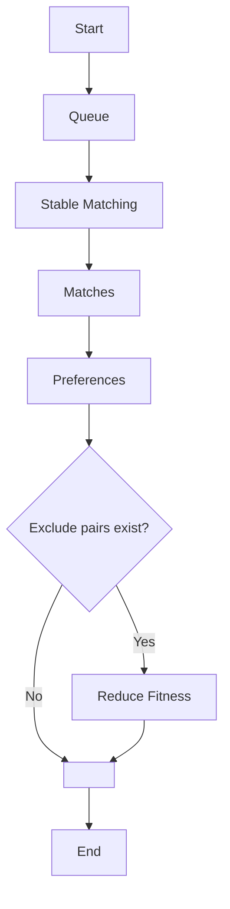
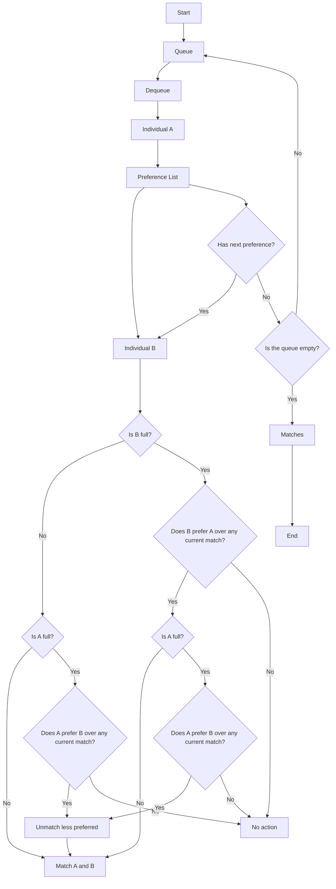

# Tổng quan về SMT (Stable Matching)
## 1. Overview

> The Stable Matching Problem (SMP) is a classical problem in algorithmic game theory, introduced by David Gale and Lloyd Shapley in 1962. It involves two sets of agents (e.g., doctors and hospitals, students and schools) who have preferences over each other, and the goal is to create a stable matching, where no two agents would prefer each other over their current partner (Nguồn: Mistralai).

Bài toán này thường được mô tả bằng ví dụ về việc ghép đôi nam và nữ, nhưng nó cũng có thể được áp dụng cho nhiều lĩnh vực khác như ghép đôi sinh viên với các vị trí thực tập, bệnh viện với bác sĩ thực tập, v.v.

## 2. Các biến thể của bài toán

### Đầu vào của bài toán

Dữ liệu đầu vào được đóng gói trong `StableMatchingProblemDto` và gửi đến API thông qua `@RequestBody`.

### Các Loại Bài toán Stable Matching

- **One-to-One (OTO)** - Bài toán cổ điển của Gale-Shapley: Mỗi thực thể trong tập hợp đầu tiên chỉ có thể ghép với đúng một thực thể trong tập hợp thứ hai.
    - Ví dụ: Một nhóm sinh viên được ghép với một nhóm trường đại học, mỗi sinh viên chỉ có thể nhập học tại một trường.
    - Thuật toán Gale-Shapley đảm bảo rằng không có hai thực thể nào có thể cải thiện tình trạng của họ bằng cách thay đổi đối tượng ghép đôi.
- **One-to-Many (OTM)** - (Một Thực Thể Có Nhiều Ghép Nối) Mở rộng từ OTO, một thực thể có thể có nhiều ghép nối, nhưng mỗi thực thể trong tập còn lại chỉ có một ghép nối.
    - Ví dụ: Một bệnh viện có thể nhận nhiều bác sĩ thực tập, nhưng mỗi bác sĩ chỉ có thể làm việc tại một bệnh viện.
    - Điều này đòi hỏi thuật toán phải xem xét khả năng tiếp nhận của mỗi thực thể trong quá trình ghép nối.
- **Many-to-Many (MTM)** - (Ghép Nhiều-Nhiều) Cả hai tập hợp đều có thể có nhiều ghép nối.
    - Ví dụ: Các freelancer có thể làm việc với nhiều công ty, và mỗi công ty có thể tuyển nhiều freelancer.
    - Đây là một mở rộng phức tạp của thuật toán Gale-Shapley, trong đó phải quản lý danh sách ưu tiên theo cả hai chiều.
- **Triplet Matching (TripletOTO)** - (Ghép Nhóm Ba) Thay vì chỉ có hai thực thể, mỗi ghép nối liên quan đến ba thực thể.
    - Ví dụ: Trong lĩnh vực y tế, một ca phẫu thuật có thể cần một bác sĩ phẫu thuật, một bác sĩ gây mê và một y tá.
    - Việc xác định sự ổn định trở nên phức tạp hơn, vì phải đảm bảo rằng cả ba thực thể đều hài lòng với lựa chọn của họ.

## 3. Về các thư viện được sử dụng

API xử lý bài toán Stable Matching được xây dựng bằng Java Spring Boot, tận dụng các công nghệ mạnh mẽ để đảm bảo hiệu suất, tính mở rộng và khả năng bảo trì. Một trong những thành phần quan trọng nhất của hệ thống là **MOEA Framework**, được sử dụng để tối ưu hóa quá trình tìm kiếm phương án ghép cặp tối ưu.

Dưới đây là các công nghệ chính được sử dụng trong hệ thống:

### **Spring Boot - Nền tảng phát triển API**

Spring Boot giúp xây dựng các ứng dụng Java nhanh chóng và dễ dàng với ít cấu hình hơn. Trong API này, Spring Boot cung cấp (Mấy cái tên packages này thì kệ cũng được :> chủ yếu là chức năng nó mang lại thui):

- **spring-boot-starter-web**: Xây dựng API RESTful xử lý các yêu cầu từ client.
- **spring-boot-starter-aop**: Hỗ trợ lập trình hướng khía cạnh (AOP), giúp quản lý logging và xử lý các logic chung một cách hiệu quả.
- **spring-boot-starter-thymeleaf**: Tích hợp Thymeleaf để hiển thị dữ liệu (nếu cần).
- **spring-boot-starter-validation**: Hỗ trợ validation dữ liệu đầu vào.
- **spring-boot-starter-websocket**: Hỗ trợ giao tiếp thời gian thực qua WebSocket.
- **spring-boot-starter-actuator**: Cung cấp thông tin theo dõi và giám sát hệ thống.

### **MOEA (Multi-Objective Evolutionary Algorithm) Framework là gì?**
MOEA Framework là một thư viện tối ưu hóa tiến hóa đa mục tiêu dành cho Java. Nó hỗ trợ nhiều thuật toán tối ưu hóa dựa trên tiến hóa, giúp tìm kiếm các giải pháp tối ưu trong các bài toán phức tạp.

### **Tại sao sử dụng MOEA Framework?**
1. **Tối ưu hóa đa mục tiêu:** Stable Matching có nhiều yếu tố ảnh hưởng đến việc ghép cặp (ví dụ: sở thích của cá nhân, yêu cầu cụ thể về năng lực, giới hạn số lượng). MOEA giúp tìm kiếm các phương án tối ưu thay vì chỉ một phương án duy nhất.
2. **Linh hoạt và mạnh mẽ:** MOEA hỗ trợ nhiều thuật toán tối ưu hóa, phù hợp với nhiều biến thể của bài toán Stable Matching như One-to-One, One-to-Many và Many-to-Many.
3. **Hiệu suất cao:** Được thiết kế để chạy hiệu quả trên các bài toán lớn, giúp xử lý hàng trăm nghìn cá nhân mà không ảnh hưởng nhiều đến thời gian chạy.

### **Các thư viện hỗ trợ khác**
- **exp4j**: Một thư viện giúp đánh giá biểu thức toán học nhanh chóng, được dùng để tính toán giá trị ưu tiên trong bài toán ghép cặp.
- **commons-csv**: Hỗ trợ đọc/ghi dữ liệu CSV, giúp nhập và xuất danh sách cá nhân tham gia bài toán Stable Matching.
- **JUnit**: Sử dụng cho kiểm thử đơn vị, đảm bảo tính chính xác của thuật toán ghép cặp.

Việc sử dụng **Spring Boot** để xây dựng API giúp phát triển nhanh, dễ dàng mở rộng và bảo trì. **MOEA Framework** là thành phần cốt lõi giúp tối ưu hóa quá trình ghép cặp với các giải pháp hiệu quả hơn so với các thuật toán ghép cặp truyền thống. Kết hợp với các thư viện hỗ trợ khác, hệ thống đảm bảo hiệu suất cao và khả năng xử lý linh hoạt nhiều biến thể của bài toán Stable Matching.

## 4. Từng component của Stable Matching được trừu tượng hóa như thế nào?

### **Individual**
Mỗi thực thể trong hệ thống được biểu diễn dưới dạng một `Individual`, chứa các thuộc tính quan trọng như:

- **Set indices**: Định danh của thực thể trong tập hợp.
- **Capacity**: Số lượng tối đa các ghép nối có thể tham gia.
- **PWR (Properties)**:
  - **Value**: Mức độ quan trọng hoặc sự phù hợp của thực thể.
  - **Weight**: Độ ưu tiên của thực thể trong quá trình ghép nối.
  - **Requirement**: Điều kiện tối thiểu cần để một ghép nối hợp lệ.

Individual không được viết dưới dạng một Object mà thay vào đó sử dụng các Arrays đại diện tương ứng cho từng *properties* của một Individual (Credit cho anh Thành và anh Hoàng). Để hình dung rõ hơn thì bạn có thể ghé vào trong `StableMatchingProblemDto` và đây là phần mà mình đang nhắc đến:

```java
  @Min(value = 2, message = ErrMessage.MES_001)
  private int numberOfSets;

  @Min(value = 1, message = ErrMessage.MES_003)
  private int numberOfProperty;

  @Size(min = 1, message = ErrMessage.MES_004)
  private int[] individualSetIndices;

  @Size(min = 1, message = ErrMessage.MES_004)
  private int[] individualCapacities;

  @Size(min = 3, message = ErrMessage.MES_002)
  @ValidRequirementSyntax
  private String[][] individualRequirements;

  @Size(min = 3, message = ErrMessage.MES_002)
  private double[][] individualWeights;

  @Size(min = 3, message = ErrMessage.MES_002)
  private double[][] individualProperties;
```


### **PreferenceList**
Danh sách ưu tiên xác định mức độ mong muốn của một thực thể đối với các thực thể khác.

#### Code Snippet - Preference List
```java
public class PreferenceList {
    private Map<Integer, List<Integer>> preferences;

    public void addPreference(int entity, List<Integer> orderedPreferences) {
        preferences.put(entity, orderedPreferences);
    }
}
```

### Cách implementation tổng quan

Hệ thống triển khai các thuật toán Stable Matching thông qua các lớp dịch vụ:

- **`StableMatchingService`**: Xử lý yêu cầu chung về bài toán Stable Matching.
- **`StableMatchingOtmService`**: Dịch vụ chuyên biệt dành cho bài toán One-to-Many Matching.
- **`TripletMatchingService`**: Xử lý bài toán mở rộng với nhóm ba thực thể.

Các thuật toán chính được sử dụng:

- **Gale-Shapley Algorithm**: Tạo một cặp ghép đôi ổn định dựa trên danh sách ưu tiên.
- **Gusfield’s Algorithm**: Tối ưu hóa cho các bài toán One-to-One với điều kiện đặc biệt.
- **Farkas’ Algorithm**: Dùng cho bài toán Triplet Matching.

Các thuật toán này được triển khai trong package `ss.smt.implement`, mỗi bài toán có một class tương ứng như `OTMProblem`, `MTMProblem`, `TripletOTOProblem`.

### Đánh Giá Kết Quả

#### **Evaluate Function**
Xác định mức độ ưu tiên của một thực thể đối với các thực thể khác dựa trên các thuộc tính của nó.

#### **Fitness Function**
Tính toán mức độ phù hợp của toàn bộ quá trình ghép đôi, thường bằng tổng giá trị danh sách ưu tiên.

#### **Exclude Pair**
Cho phép loại bỏ các cặp ghép không mong muốn.

#### **Capacity**
Giới hạn số ghép nối tối đa của mỗi thực thể.

### Quy trình xử lý

Mỗi vòng lặp sẽ xử lý danh sách hàng đợi để tạo ra ghép nối ổn định, đồng thời đánh giá và điều chỉnh bằng thuật toán di truyền.



### Core Stable Matching

Hệ thống mở rộng thuật toán Gale-Shapley để hỗ trợ Many-to-Many Matching.



### Chạy Bài Toán SMT
Phần code để mô tả cách gọi `StableMatchingService`:


```java
public class SMTExecutor {
    public static void main(String[] args) {
        StableMatchingService service = new StableMatchingService();
        List<Matches> result = service.executeMatching(problemInstance);
        System.out.println(result);
    }
}
```

Các dịch vụ được sử dụng trong Controller để hình thành một API hoàn chỉnh, giúp xử lý bài toán Stable Matching hiệu quả và dễ dàng mở rộng.

