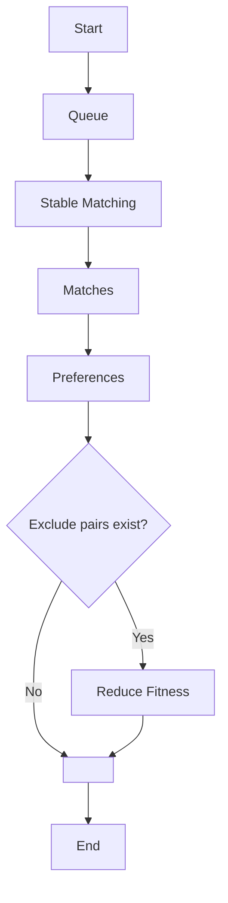
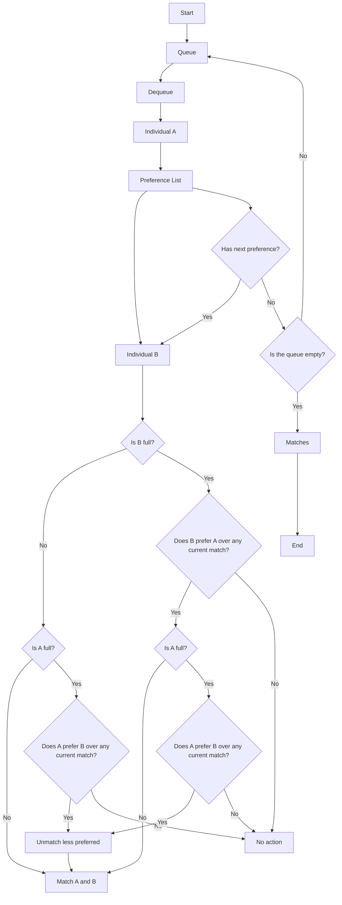

# Overview of SMT (Stable Matching)
## 1. Overview

In mathematics, economics, and computer science, the stable marriage problem (also stable matching problem) is the problem of finding a stable matching between two equally sized sets of elements given an ordering of preferences for each element. A matching is a bijection from the elements of one set to the elements of the other set. A matching is not stable if:

1. There is an element A of the first matched set which prefers some given element B of the second matched set over the element to which A is already matched, and
2. B also prefers A over the element to which B is already matched.

In other words, a matching is stable when there does not exist any pair (A, B) which both prefer each other to their current partner under the matching.

_Extracted from [Wikipedia](https://en.wikipedia.org/wiki/Stable_marriage_problem). This problem is conventionally referred as Stable marriage problem._

This problem (Stable Matching Problem) is often illustrated using the example of pairing men and women in a dating scenario, but it has broader applications, including student-internship assignments, hospital-resident placements, and job-market matchmaking.

## Stable Matching Problem's Variants

### Input

A StableMatchingProblemDto object, sent from the front-end via API and converted using @RequestBody. All of the work is automatic, the only thing you have to do is import the source file (`.xlsx`).


```java
@Autowired
private StableMatchingService stableMatchingSolver;

// Running `solve()` with the input being the StableMatchingProblemDto object - the input data sent from the front-end, converted to StableMatchingProblemDto using @RequestBody.

@PostMapping("/stable-matching-solver")
public CompletableFuture<ResponseEntity<Response>> solveStableMatching(
        @RequestBody @Valid StableMatchingProblemDto object) {
    return CompletableFuture.completedFuture(stableMatchingSolver.solve(object));
}
```

### Stable Matching Problem's Types

- One-to-One (OTO) - The classical Gale-Shapley problem: Each entity in the first set can only be matched with exactly one entity in the second set.
    - Example: A group of students is matched with a group of universities, where each student can only enroll in one university.
    - The Gale-Shapley algorithm ensures that no two entities can improve their situation by switching partners.
- One-to-Many (OTM) - An extension of OTO, where one entity can have multiple matches, but each entity in the other set has only one match.
    - Example: A hospital can accept multiple interns, but each intern can only work at one hospital.
    - This requires the algorithm to consider the capacity of each entity during the matching process.
- Many-to-Many (MTM) - Both sets can have multiple matches.
    - Example: Freelancers can work with multiple companies, and each company can hire multiple freelancers.
    - This is a complex extension of the Gale-Shapley algorithm, where preference lists must be managed in both directions.
- Triplet Matching (TripletOTO) - Instead of just two entities, each match involves three entities.
    - Example: In the medical field, a surgery may require a surgeon, an anesthesiologist, and a nurse.
    - Determining stability becomes more complex, as it must be ensured that all three entities are satisfied with their choices.

## 3. Libraries

The API for handling the Stable Matching problem is built using Java with Spring Boot, leveraging powerful technologies to ensure performance, scalability, and maintainability. One of the most important components of the system is the MOEA Framework, which is used to optimize the search for optimal pairing solutions. Below are the main technologies used in the system:

### Spring Boot - API Development Platform

Spring Boot helps build Java applications quickly and easily with less configuration. In this API, Spring is used to handle the logic for the Web Server - building a RESTful API that processes requests from clients.

### MOEA (Multi-Objective Evolutionary Algorithm)

The MOEA Framework is a multi-objective evolutionary optimization library that helps find optimal solutions in complex problems like Stable Matching. Instead of just applying the traditional Gale-Shapley algorithm, the system leverages optimization algorithms to find the most beneficial pairing solutions based on multiple criteria. The MOEA Framework supports:

- Global solution search: Avoiding local minima of the Gale-Shapley algorithm.
- Multi-objective optimization: Balancing multiple factors in matching, such as individual preferences and capacity limits.
- High performance: Handling large-scale problems with complex constraints.

Spring Boot to build the API facilitates rapid development, easy scaling, and maintenance while MOEA Framework helps optimize the pairing process with more efficient solutions compared to traditional matching algorithms. Combined with other supporting libraries, the system ensures high performance and the ability to flexibly handle various variants of the Stable Matching problem.

## 4. Abstraction

### Individual

Each entity in the system is represented as an `individual` object, including:

- Set indices: Identifier of the entity within its set.
- Capacity: The maximum number of matches the entity can participate in.
- PWR (Properties):
  - Value: The level of importance or suitability of the entity.
  - Weight: The priority of the entity during the matching process.
  - Requirement: The minimum condition required for a valid match.

`Individual` is not written as an Object in Java but instead uses multiple arrays representing each *property* of an Individual. Here is how it looks like when written in Java:

```java
  @Min(value = 2, message = ErrMessage.MES_001)
  private int numberOfSets;

  @Min(value = 1, message = ErrMessage.MES_003)
  private int numberOfProperty;

  @Size(min = 1, message = ErrMessage.MES_004)
  private int[] individualSetIndices;

  @Size(min = 1, message = ErrMessage.MES_004)
  private int[] individualCapacities;

  @Size(min = 3, message = ErrMessage.MES_002)
  @ValidRequirementSyntax
  private String[][] individualRequirements;

  @Size(min = 3, message = ErrMessage.MES_002)
  private double[][] individualWeights;

  @Size(min = 3, message = ErrMessage.MES_002)
  private double[][] individualProperties;
```

Here is the JSON format:

```json
{
  "numberOfSets": 3,
  "numberOfProperty": 2,
  "individualSetIndices": [0, 1, 2],
  "individualCapacities": [2, 3, 1],
  "individualRequirements": [
    ["", ""],
    ["", ""],
    ["", ""]
  ],
  "individualWeights": [
    [0.5, 0.3],
    [0.7, 0.2],
    [0.4, 0.6]
  ],
  "individualProperties": [
    [1.0, 2.5],
    [3.2, 4.1],
    [5.0, 6.3]
  ]
}
```

### PreferenceList

The preference list defines the level of desirability of one entity towards other entities.

```java
public class PreferenceList {
    private Map<Integer, List<Integer>> preferences;

    public void addPreference(int entity, List<Integer> orderedPreferences) {
        preferences.put(entity, orderedPreferences);
    }
}
```

### Overall Implementation Approach

The system implements Stable Matching algorithms through service classes:

- `StableMatchingService`: Handles general requests for the Stable Matching problem.
- `StableMatchingOtmService`: Specialized service for the One-to-Many Matching problem.
- `TripletMatchingService`: Handles the extended problem with groups of three entities.

The main algorithms used are:

- Gale-Shapley Algorithm: Creates a stable pairing based on preference lists.
- Gusfield’s Algorithm: Optimized for One-to-One problems with specific conditions.
- Farkas’ Algorithm: Used for the Triplet Matching problem.

These algorithms are implemented in the `ss.smt.implement` package, with each problem having a corresponding class like `OTMProblem`, `MTMProblem`, `TripletOTOProblem`.

### Result Evaluation

- **Evaluate Function**: Determines the preference level of one entity towards other entities based on its properties.
- **Fitness Function**: Calculates the suitability level of the entire matching process, usually as the sum of preference list values.
- **Exclude Pair**: Allows for the exclusion of undesirable pairs.
- **Capacity**: Limits the maximum number of matches for each entity.

### Processing Flow




### Core Stable Matching


### Running the SMT Problem
The code snippet to describe how to use `StableMatchingService`:

```java

@Autowired
private StableMatchingService stableMatchingSolver;

// Running `solve()` with the input being the StableMatchingProblemDto object - the input data sent from the front-end, converted to StableMatchingProblemDto using @RequestBody.

@PostMapping("/stable-matching-solver")
public CompletableFuture<ResponseEntity<Response>> solveStableMatching(
        @RequestBody @Valid StableMatchingProblemDto object) {
    return CompletableFuture.completedFuture(stableMatchingSolver.solve(object));
}

```

The services used in the Controller form a complete API, helping to handle the Stable Matching problem efficiently and easily scalable.
